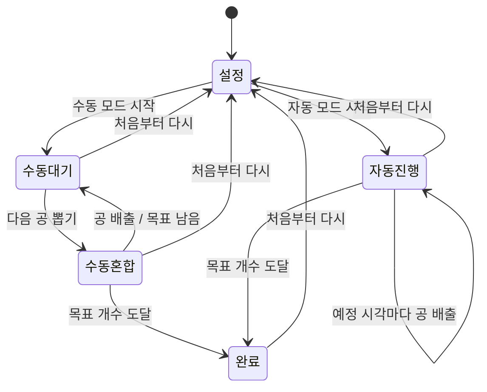

# 로또 추첨기 웹앱 스펙

## 1. 문서 개요

- 제품명: 로또 추첨기
- 문서 경로: `docs/SPEC.md`
- 문서 목적: 브라우저에서 동작하는 로또 형식의 순차 추첨 웹앱에 대한 제품·기술 요구사항을 정의한다.
- 초기 버전의 기준 공 개수: 최소 2개, 최대 45개
- 대상 사용자: 별도의 가입이나 설치 없이 이름 목록을 무작위 순서로 추첨하려는 사용자

## 2. 목표와 배경

### 2.1 목표

- 사용자가 여러 이름을 입력하고 로또 추첨기와 유사한 시각적 연출로 전체 또는 지정한 개수의 공을 무작위 순서대로 뽑을 수 있게 한다.
- 같은 이름이 여러 번 입력된 경우에도 각각을 독립된 공으로 취급한다.
- 수동 추첨과 자동 추첨을 모두 제공한다.
- 모바일과 데스크톱의 최신 웹 브라우저에서 동등하게 사용할 수 있게 한다.
- 서버 없이 정적 웹앱으로 동작하고, 입력 목록만 브라우저에 보존한다.

### 2.2 성공 기준

- 유효한 이름 2~45개로 추첨을 시작할 수 있다.
- 중복 이름을 포함한 후보 중 설정한 목표 개수만큼 누락·중복 없이 뽑힌다.
- 추첨 결과가 브라우저의 암호학적 난수에 의해 결정되며 Canvas 연출과 독립적이다.
- 새로고침하거나 설정으로 돌아가면 추첨 진행 상태는 초기화되고 입력 목록만 유지된다.
- 자동 모드가 백그라운드 탭의 타이머 제한을 받더라도 경과 시간을 기준으로 논리적 추첨 상태를 복구한다.

## 3. 범위

### 3.1 범위 내

- 줄바꿈 또는 콤마로 구분된 이름 일괄 입력
- `시작숫자~끝숫자` 형식의 숫자 범위 입력
- 입력 검증 및 오류 표시
- 중복 이름을 서로 다른 공으로 처리
- 수동·자동 추첨 모드
- 전체 또는 지정한 개수의 비복원 순차 추첨
- Canvas 2D 기반의 공 섞임과 배출 연출
- 추첨 순서 누적 표시와 결과 복사
- 입력 목록의 브라우저 저장
- 효과음 음소거/활성화 토글
- 모바일·데스크톱 반응형 UI
- 최신 안정 버전 Chrome, Safari, Firefox, Edge 지원

### 3.2 초기 범위 밖

- 서버, 데이터베이스, 회원가입, 로그인, 기기 간 동기화
- 배포 설정, 배포 안내, CI/CD 및 특정 호스팅 서비스 연동
- PWA 설치 및 명시적인 오프라인 지원
- 46개 이상의 공
- 추첨 결과 파일 다운로드
- 추첨 결과 영구 저장 및 새로고침 후 복구
- 자동 추첨 일시정지·재개
- 추첨 중 수동/자동 모드 전환
- 애니메이션 건너뛰기
- 실제 물리 엔진 수준의 충돌 시뮬레이션
- 난수 시드, 결과 재현, 감사 로그
- 다국어 지원
- 접근성 전용 기능 및 운영체제의 동작 줄이기 설정 대응
- 사용자 분석, 원격 오류 수집 및 운영 모니터링

## 4. 우선순위

| 우선순위 | 의미 | 요구사항 |
|---|---|---|
| P0 | 출시 필수 | 입력·검증, 추첨 개수 설정, 암호학적 난수, 비복원 추첨, 수동·자동 모드, 상태 초기화, 입력 저장, 결과 누적 |
| P1 | 초기 경험 필수 | Canvas 2D 연출, 반응형 UI, 결과 복사, 백그라운드 경과 상태 복구 |
| P2 | 품질 보강 | 효과음 토글, 저장·복사 실패 안내, 별도 데스크톱 스모크 테스트 |
| 향후 | 초기 범위 밖 | 46개 이상 공 확장, WebGL·실제 3D 엔진, 배포 자동화, 접근성, 모니터링 |

## 5. 기능 요구사항

### 5.1 이름 입력

- 설정 화면에는 여러 이름을 한 번에 입력할 수 있는 단일 텍스트 영역을 제공한다.
- 줄바꿈 또는 콤마를 이름 구분자로 사용한다.
- 파싱 시 각 항목의 앞뒤 공백을 제거한다.
- 공백만 있거나 비어 있는 항목은 무시한다.
- 콤마 자체를 이름에 포함하는 기능은 지원하지 않는다.
- 같은 문자열의 이름을 여러 번 입력할 수 있다.
- 입력 전체가 `시작숫자~끝숫자` 형식이면 시작부터 끝까지의 정수를 오름차순 문자열 이름으로 확장한다.
- `1~45`는 `"1"`부터 `"45"`까지 45개 이름으로 해석한다.
- 숫자 범위에는 ASCII 물결표 `~`를 사용하며 앞뒤 공백은 허용한다.
- 숫자 범위는 단독으로만 입력하며 일반 이름, 콤마, 줄바꿈 또는 다른 범위와 혼합하지 않는다.
- 범위의 선행 0은 제거한다. 예를 들어 `01~03`은 `"1"`, `"2"`, `"3"`으로 해석한다.
- 입력 목록은 사용자가 수정할 때 브라우저 저장소에 보존한다.
- `모두 지우기`는 입력창과 브라우저에 저장된 이름 목록을 함께 삭제한다.

### 5.2 입력 검증

- 유효한 이름 개수는 최소 2개, 최대 45개다.
- 숫자 범위의 시작과 끝은 0 이상의 안전한 정수이며 시작 숫자는 끝 숫자보다 클 수 없다.
- 숫자 범위가 생성하는 공 개수도 최소 2개, 최대 45개다.
- 이름 하나의 최대 길이는 20자다.
- 제한을 벗어난 입력은 자동으로 자르거나 일부만 선택하지 않는다.
- 검증 실패 시 원인을 한국어로 표시하고 추첨 시작 버튼을 비활성화한다.
- 중복 이름은 검증 오류가 아니다.

### 5.3 추첨 개수·모드 선택과 시작

- 설정 화면에서 `전체 추첨` 또는 `일부만 추첨`을 선택한다.
- 기본값은 `전체 추첨`이며 입력한 모든 공을 목표 개수로 사용한다.
- `일부만 추첨`은 1부터 현재 유효한 공 개수까지의 정수를 직접 입력한다.
- 추첨 개수가 비어 있거나 정수가 아니거나 허용 범위를 벗어나면 원인을 한국어로 표시하고 시작 버튼을 비활성화한다.
- 설정 화면에서 수동 또는 자동 모드를 선택한다.
- 추첨 시작 후 이름 입력, 추첨 개수와 모드 선택을 비활성화한다.
- 추첨 도중 설정을 바꾸려면 `처음부터 다시`를 사용해야 한다.
- `처음부터 다시`는 즉시 재추첨하지 않는다.
- `처음부터 다시`를 누르면 기존 입력 목록과 현재 설정을 유지한 채 설정 화면으로 돌아가며 입력, 추첨 개수와 모드 선택을 다시 활성화한다.
- 재시작 확인창은 표시하지 않는다.

### 5.4 공과 추첨 규칙

- 입력된 각 이름은 별도의 공 객체로 생성한다.
- 중복 이름의 공은 화면의 이름이 같더라도 내부 고유 ID로 구분한다.
- 추첨은 비복원 방식이다. 한 번 뽑힌 공은 남은 공에서 제거한다.
- 결과 개수가 설정한 추첨 목표 개수에 도달하면 해당 추첨이 완료된다.
- 일부 추첨 완료 시 뽑히지 않은 공은 미추첨 후보로 남으며 결과에 포함하지 않는다.
- 추첨 결과는 브라우저의 `crypto.getRandomValues()`로 결정한다.
- 선택 편향을 방지하기 위해 난수 범위 변환 시 거부 샘플링(rejection sampling)을 사용한다.
- 난수 생성에 실패하면 낮은 품질의 난수로 대체하지 않고 추첨을 중단한 뒤 오류를 표시한다.
- 추첨 결과 선택과 Canvas 애니메이션은 서로 분리한다. 시각적 충돌이나 공의 화면 위치는 결과에 영향을 주지 않는다.

### 5.5 수동 추첨

- 사용자가 `다음 공 뽑기`를 누르면 버튼을 일시적으로 비활성화한다.
- 공을 약 2~3초 동안 강하게 섞는 연출 후 선택된 공을 배출한다.
- 배출 연출과 결과 반영이 끝난 후 목표 개수가 남아 있으면 버튼을 다시 활성화한다.
- 목표 개수의 마지막 공이 배출되면 완료 상태로 전환한다.

### 5.6 자동 추첨

- 자동 모드는 시작 후 설정한 목표 개수까지 사용자 조작 없이 진행한다.
- 각 공의 추첨 간격은 3~7초 사이의 정수 초를 암호학적 난수로 균등하게 선택한다.
- 첫 공에도 동일한 3~7초 대기 시간을 적용한다.
- 다음 공이 나올 때까지의 카운트다운이나 예정 시각은 표시하지 않는다.
- 화면이 보이는 동안 공은 계속 섞이고 예정 시각에 공 하나가 예고 없이 배출된다.
- 자동 모드에는 일시정지·재개 기능을 제공하지 않는다.
- 자동 시작 시 전체 후보를 암호학적으로 섞은 뒤 목표 개수만 선택하고, 선택된 공의 누적 예정 시각을 결정한다.
- 탭이 백그라운드로 이동해도 논리적 추첨 시간은 계속 경과한다.
- 브라우저가 백그라운드 타이머나 애니메이션을 제한한 경우, 다시 실행 가능한 시점에 현재 시각과 예정 시각을 비교해 이미 지난 공들을 추첨 완료 상태로 반영한다.
- 사용자가 보지 못한 배출 애니메이션은 다시 연속 재생하지 않는다.
- 기기 절전, 브라우저 중단 등으로 실제 코드 실행이 정지된 동안에도 복귀 후 경과 시간에 따라 상태를 복구하되, 운영체제 수준에서의 실시간 백그라운드 실행 자체는 보장하지 않는다.

### 5.7 결과 표시와 복사

- 배출된 공은 `1번째`, `2번째` 순서로 결과 목록에 누적한다.
- 공 내부에서는 긴 이름을 말줄임표로 표시한다.
- 결과 목록에서는 최대 20자의 전체 이름을 표시한다.
- 설정한 목표 개수까지 뽑히면 완료 메시지를 표시한다.
- 결과 카운터는 `현재 결과 개수 / 목표 개수` 형식으로 표시한다.
- 결과 복사는 다음 형식의 일반 텍스트를 클립보드에 기록한다.

```text
1. 민지
2. 준호
3. 민지
```

- 결과 복사가 성공하면 짧은 성공 피드백을 표시한다.
- 클립보드 접근이 거부되거나 복사에 실패하면 오류 알림만 표시하며 별도의 수동 복사 UI는 제공하지 않는다.

### 5.8 효과음

- 공 섞임·배출 또는 결과 공개 효과음을 제공한다.
- 최초 상태는 음소거다.
- 사용자는 화면의 토글로 효과음을 활성화하거나 다시 음소거할 수 있다.
- 소리 재생 실패는 추첨을 중단시키지 않는다.

### 5.9 저장과 초기화

- 이름 입력 목록만 `localStorage`에 저장한다.
- 저장 값은 `{ version: 1, rawInput: string }` 형식으로 입력 원문과 스키마 버전을 포함한다.
- 추첨 개수 설정, 추첨 모드, 남은 공, 뽑힌 순서, 자동 추첨 일정, 완료 상태는 저장하지 않는다.
- 새로고침하면 저장된 입력 목록을 복원하고 설정 화면에서 새 추첨을 시작한다.
- 저장 실패 시 현재 세션의 입력과 추첨 기능은 유지하고 `목록을 저장하지 못했습니다`라는 경고를 표시한다.
- 저장 데이터는 버전이 포함된 키를 사용해 향후 형식 변경에 대비한다.

## 6. UI/UX

### 6.1 시각 방향

- 한국어 단일 언어 UI를 사용한다.
- 밝은 배경과 투명한 원형 추첨기를 중심으로 현대적인 로또 방송 스타일을 적용한다.
- 공은 서로 구분하기 쉬운 여러 색상을 사용한다.
- 핵심 행동 버튼은 명확한 강조색을 사용한다.
- 모바일과 데스크톱에서 기능 차이 없이 반응형으로 배치한다.

### 6.2 주요 화면 상태

1. 설정
   - 이름 입력
   - 입력 오류
   - 전체/일부 추첨과 목표 개수 입력
   - 수동/자동 선택
   - 효과음 토글
   - 모두 지우기
   - 추첨 시작
2. 수동 추첨 진행
   - 이름과 모드 잠금
   - 추첨기와 남은 공
   - 다음 공 뽑기
   - 누적 결과
   - 처음부터 다시
3. 자동 추첨 진행
   - 이름과 모드 잠금
   - 계속 섞이는 추첨기
   - 예정 시각을 숨긴 자동 배출
   - 누적 결과
   - 처음부터 다시
4. 완료
   - 목표 개수만큼의 추첨 순서
   - 일부 추첨 시 남은 미추첨 후보
   - 결과 복사
   - 처음부터 다시

### 6.3 상태 흐름



### 6.4 엣지 케이스

- `민지, 민지`는 동일한 이름을 가진 서로 다른 두 공으로 생성한다.
- `민지,, 준호`의 빈 항목은 무시하고 두 개의 공으로 처리한다.
- `1~45`는 숫자 이름을 가진 45개의 서로 다른 공으로 생성한다.
- `1~3,민지`, `민지~준호`, `3~1`, `1~1`, `1~46`은 오류를 표시하고 시작하지 않는다.
- 46개 이상 입력하면 일부를 버리지 않고 오류를 표시한다.
- 45개를 입력하고 추첨 개수를 6개로 설정하면 여섯 번째 공에서 완료하고 나머지 39개는 결과에서 제외한다.
- 일부 추첨 개수가 0, 소수, 빈 값 또는 전체 공 개수보다 크면 시작하지 않는다.
- 20자를 초과한 이름은 저장 시 임의로 자르지 않고 오류를 표시한다.
- 추첨 중 버튼을 연속 클릭해도 하나의 추첨만 시작한다.
- `처음부터 다시`가 애니메이션 도중 실행되면 진행 중 연출과 예약 작업을 취소하고 설정 상태로 전환한다.
- 자동 모드에서 여러 예정 시각이 지난 뒤 탭이 복귀하면 결과 순서를 유지해 지난 항목을 한 번만 반영한다.
- 새로고침은 진행 중 추첨을 복구하지 않는다.
- 저장·복사·효과음 실패는 서로 독립적으로 처리하며 가능한 핵심 추첨 기능을 유지한다.

## 7. 기술 설계

### 7.1 기술 구성

- UI 프레임워크: React
- 언어: TypeScript
- 빌드 도구: Vite
- 렌더링: React DOM + HTML Canvas 2D
- 저장소: 브라우저 `localStorage`
- 난수: Web Crypto API
- 배포 형태: 표준 정적 빌드 산출물

특정 호스팅 서비스용 설정과 실제 배포는 초기 범위에서 제외한다. 서버 API와 클라우드 저장소는 사용하지 않는다.

### 7.2 컴포넌트 경계

- `SetupPanel`: 이름·추첨 개수 입력, 검증 결과, 모드 선택, 시작, 모두 지우기
- `LotteryMachine`: Canvas 생성·크기 조정·공 움직임·배출 연출
- `DrawControls`: 다음 공 뽑기, 처음부터 다시, 효과음 토글
- `ResultList`: 누적 결과, 완료 상태, 결과 복사
- `DrawEngine`: 공 생성, 난수 추첨, 자동 일정, 상태 전이
- `NameStorage`: 입력 목록 저장·복원·삭제와 실패 처리
- `SoundController`: 사용자 설정과 브라우저 오디오 재생

`DrawEngine`은 DOM과 Canvas에 의존하지 않는 순수 로직 중심 모듈로 유지해 추첨 정확성을 자동 테스트할 수 있게 한다.

### 7.3 데이터 모델

```ts
type Ball = {
  id: string;
  name: string;
  color: string;
};

type DrawMode = "manual" | "auto";
type DrawCountMode = "all" | "custom";
type DrawPhase = "setup" | "ready" | "mixing" | "running" | "completed" | "error";

type DrawResult = {
  order: number;
  ballId: string;
  name: string;
  drawnAt: number;
};

type ScheduledDraw = {
  order: number;
  ballId: string;
  dueAt: number;
};

type DrawSession = {
  mode: DrawMode;
  drawCount: number;
  phase: DrawPhase;
  balls: Ball[];
  remainingBallIds: string[];
  results: DrawResult[];
  schedule: ScheduledDraw[];
  startedAt: number | null;
  pendingBallId: string | null;
  error: string | null;
};
```

- 고유 ID는 중복 이름을 구분하는 용도로만 사용하며 사용자에게 식별 번호로 노출하지 않는다.
- `drawCount`는 세션 시작 시 확정하며 전체 공 개수 이내의 양의 정수다.
- Canvas의 좌표·속도 같은 연출 상태는 추첨 세션 데이터와 분리한다.
- 새 추첨을 시작할 때 공과 세션을 새로 생성한다.

### 7.4 내부 계약

외부 네트워크 API는 없다. 주요 내부 함수는 다음 계약을 따른다.

```ts
parseNames(raw: string): {
  names: string[];
  errors: string[];
}

validateDrawCount(
  mode: DrawCountMode,
  customValue: string,
  availableCount: number
): {
  value: number;
  errors: string[];
}

secureRandomIndex(length: number): number

createDrawOrder(balls: Ball[]): string[]

createDrawSession(
  balls: Ball[],
  mode: DrawMode,
  drawCount: number,
  startedAt: number
): DrawSession

createAutoSchedule(
  orderedBallIds: string[],
  startedAt: number
): ScheduledDraw[]

reconcileScheduledDraws(
  session: DrawSession,
  now: number
): DrawSession

formatResults(results: DrawResult[]): string
```

- `secureRandomIndex`는 `length > 0`에서만 호출하며 Web Crypto 실패 시 예외를 반환한다.
- `validateDrawCount`는 전체 추첨이면 후보 수를, 일부 추첨이면 검증된 정수를 반환한다.
- `parseNames`는 `~`가 포함된 입력을 숫자 범위 전용 문법으로 먼저 해석하며, 범위식이 아니면 기존 줄바꿈·콤마 이름 파싱을 수행한다.
- `createDrawOrder`는 입력 공을 정확히 한 번씩 포함하는 암호학적 무작위 순열을 반환한다.
- `createDrawSession`은 순열에서 목표 개수만 사용하며 유효하지 않은 `drawCount`를 거부한다.
- `createAutoSchedule`은 목표 공 ID 각각의 사이에 3~7초의 균등 무작위 간격을 누적한다.
- `reconcileScheduledDraws`는 같은 일정 항목을 두 번 결과에 반영하지 않는 멱등성을 가져야 한다.

### 7.5 Canvas 연출

- 초기 구현은 별도 물리 엔진 없이 Canvas 2D와 `requestAnimationFrame`을 사용한다.
- 각 공은 가상 `x`, `y`, `z` 위치와 3축 속도를 가지며 구형 공간 경계에서 반사한다.
- 혼합 중에는 여러 회전축의 흐름과 시간·공별 위상이 다른 난류를 적용해 방향과 깊이를 지속해서 바꾼다.
- 공마다 위상이 다른 횡단 목표점을 구의 양쪽 사이로 이동시키고, 목표점이 중앙을 지날 때 회전 흐름을 줄여 공이 중앙을 가로지르게 한다.
- 공끼리의 평면 충돌 해소는 사용하지 않는다. 서로 다른 깊이의 공이 2D 화면에서 겹치도록 허용해 실제 구형 추첨기의 투영처럼 보이게 한다.
- 공을 가상 깊이순으로 정렬하고 뒤쪽부터 렌더링한다.
- 모든 공은 깊이와 관계없이 같은 크기로 렌더링하고, 투명도와 그리기 순서만으로 앞뒤를 구분한다.
- 혼합 중에는 속도 방향의 짧은 잔상과 회전 표시를 사용하되 이름 판독을 방해하지 않는 범위로 제한한다.
- 추첨 결과가 결정된 뒤 해당 공을 배출구 방향으로 이동시키는 연출을 수행한다.
- 일부 추첨이 완료되어 공이 남으면 혼합·대기 운동을 중단하고 아래 방향 중력, 구형 바닥 반발, 공 간 충돌과 마찰을 적용한다.
- 완료 후 남은 공은 구형 경계를 벗어나거나 서로 관통하지 않고 바닥부터 여러 층으로 쌓이며, 반발과 속도는 점차 감쇠한다.
- 혼합 중에는 화면상 겹침을 위해 공 간 충돌을 사용하지 않고, 물리적 적층이 필요한 완료 후 정착 단계에서만 충돌을 계산한다.
- Canvas 프레임 저하나 일시 중단은 `DrawEngine`의 결과 및 자동 예정 시각을 변경하지 않는다.
- 기기 성능이 부족하면 연출의 부드러움보다 추첨 정확성을 우선한다.
- 46개 이상 공 확장이나 WebGL·실제 3D 엔진 도입은 테스트 결과를 근거로 별도 판단한다.

## 8. 오류 처리

| 상황 | 처리 |
|---|---|
| 입력 개수·길이 오류 | 원인 표시, 시작 비활성화 |
| 추첨 개수 오류 | 원인 표시, 시작 비활성화 |
| Web Crypto 실패 | 추첨 중단, 오류 표시, 비보안 난수 대체 금지 |
| `localStorage` 저장 실패 | 경고 표시, 현재 세션 사용 유지 |
| 클립보드 복사 실패 | 오류 알림만 표시 |
| 효과음 재생 실패 | 무음으로 계속 진행 |
| Canvas 연출 오류 | 오류를 격리하고 가능하면 결과·제어 UI 유지 |
| 백그라운드 타이머 지연 | 절대 예정 시각 기준으로 누락 상태 복구 |

오류 메시지는 기술적인 예외 문자열을 그대로 노출하지 않고 사용자가 취할 수 있는 행동 중심의 한국어로 표시한다.

## 9. 비기능 요구사항

### 9.1 정확성과 공정성

- 정확성은 시각적 부드러움보다 우선한다.
- 한 세션의 결과 개수는 설정한 목표와 같아야 하며 같은 공이 두 번 등장하면 안 된다.
- 전체 추첨을 선택한 경우 모든 유효한 공이 정확히 한 번씩 결과에 등장해야 한다.
- 자동 일정 복구와 중복 이벤트에도 결과가 중복 반영되지 않아야 한다.
- 공 선택에는 Web Crypto API만 사용한다.

### 9.2 성능

- 최대 45개의 공을 기준으로 설계한다.
- 엄격한 FPS 목표는 두지 않는다.
- 저성능 기기에서 Canvas 프레임이 낮아져도 추첨 순서, 제거, 완료 상태는 정확해야 한다.
- 화면 크기 변경 시 Canvas를 재배치하되 추첨 세션은 유지한다.

### 9.3 호환성

- 출시 시점의 Chrome, Safari, Firefox, Edge 최신 안정 버전을 지원한다.
- 모바일과 데스크톱에서 동일한 기능을 제공한다.
- 구버전 브라우저 호환성은 보장하지 않는다.

### 9.4 보안과 개인정보

- 이름은 외부 서버로 전송하지 않는다.
- 이름은 사용자의 브라우저 `localStorage`에 평문으로 저장되므로 공용 기기에서는 `모두 지우기`로 삭제할 수 있게 한다.
- 사용자 입력은 HTML로 해석하지 않고 텍스트로만 렌더링한다.
- 외부 스크립트가 필요하면 공급망 위험을 줄이도록 의존성을 최소화한다.

## 10. 테스트와 검수

### 10.1 자동 테스트

- 줄바꿈·콤마 혼합 입력 파싱
- 숫자 범위의 오름차순 확장, 단독 입력 규칙, 역순·개수 경계 검증
- 앞뒤 공백 제거와 빈 항목 무시
- 최소·최대 개수 및 20자 길이 검증
- 중복 이름을 별도 ID의 공으로 생성
- 전체·일부 비복원 추첨과 추첨 개수 경계
- 난수 실패 시 추첨 중단
- 수동 모드의 중복 클릭 방지
- 자동 일정의 3~7초 범위와 누적 시각
- 백그라운드 경과 후 일정 복구의 멱등성
- `처음부터 다시`와 새로고침 상태 초기화
- 저장·복사 실패 분기
- 결과 복사 문자열 형식

### 10.2 구현 검수

- 모바일과 데스크톱에서 설정·추첨·완료 화면이 잘리거나 겹치지 않는지 확인한다.
- 공 이름 말줄임표와 결과 목록의 전체 이름을 확인한다.
- 수동 모드에서 2~3초 혼합 후 한 공만 배출되는지 확인한다.
- 45개 중 6개 수동·자동 추첨이 여섯 번째 공에서 완료되고 나머지를 결과에서 제외하는지 확인한다.
- 자동 모드에서 카운트다운 없이 3~7초 사이에 공이 배출되는지 확인한다.
- 백그라운드 탭 복귀 시 지난 결과가 올바른 순서로 한 번만 반영되는지 확인한다.
- 저성능 조건에서 Canvas가 느려져도 결과가 정확한지 확인한다.
- 45개 혼합 중 모든 공 크기가 같고, 일부 공이 중앙을 통과하면서 바깥 공과 자연스럽게 겹치며 수백 ms 사이에 충분히 위치가 변하는지 확인한다.
- 일부 추첨 완료 후 남은 공이 중력으로 내려와 구형 바닥에 겹치지 않고 쌓이며 안정적으로 정지하는지 확인한다.
- 연속 수동 추첨에서 직전 배출 공 연출이 다시 시작되지 않는지 확인한다.
- 구현 완료 후 데스크톱 레이아웃을 대상으로 별도의 스모크 테스트를 진행한다.

## 11. 출시 승인 조건

- P0·P1·P2 요구사항이 구현되어 있다.
- 자동 테스트가 통과한다.
- 모바일·데스크톱 핵심 흐름 검수가 완료된다.
- 별도 데스크톱 레이아웃 스모크 테스트가 통과한다.
- 알려진 문제 중 추첨 정확성, 결과 중복·누락, 데이터 외부 전송과 관련된 결함이 없다.
- 정적 프로덕션 빌드가 성공한다.

## 12. 리스크와 향후 검토 항목

- 가상 3D 투영은 실제 카메라·조명·공 충돌을 계산하지 않는다. 깊이감이나 속도감 개선이 더 필요하면 WebGL 또는 실제 3D 엔진 도입을 별도 판단한다.
- 백그라운드 탭의 실제 실행 빈도는 브라우저·운영체제 정책에 따라 달라진다. 절대 시각 기반 복구로 논리적 일관성은 보장하지만 보이지 않는 애니메이션 실행은 보장하지 않는다.
- 공 개수를 45개보다 늘리면 가독성, 3축 운동 계산량, 모바일 배치가 달라지므로 별도 성능·UX 검증이 필요하다.
- GitHub Pages, Vercel, Cloudflare Pages 등 실제 호스팅 환경의 설정과 자동 배포는 후속 범위에서 결정한다.
- 접근성, 운영 모니터링, 다국어, 결과 저장은 후속 우선순위에서 다시 평가한다.
