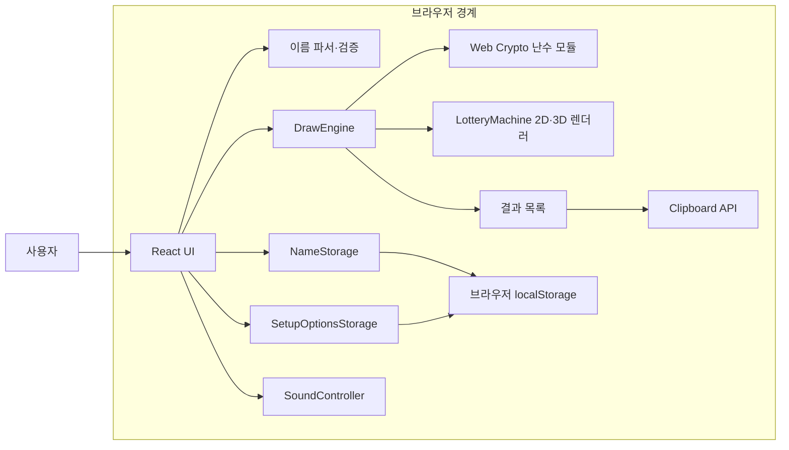
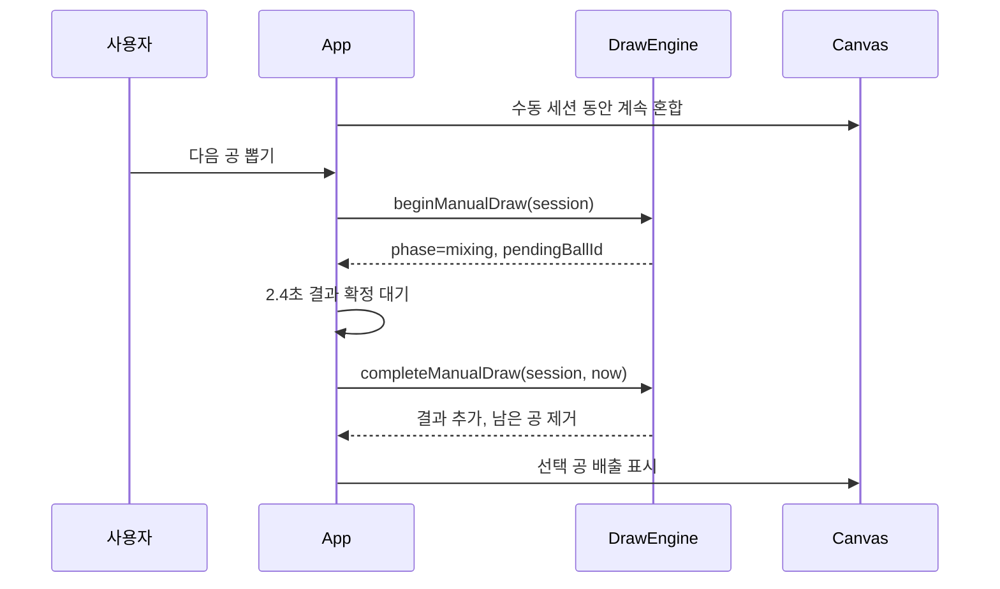
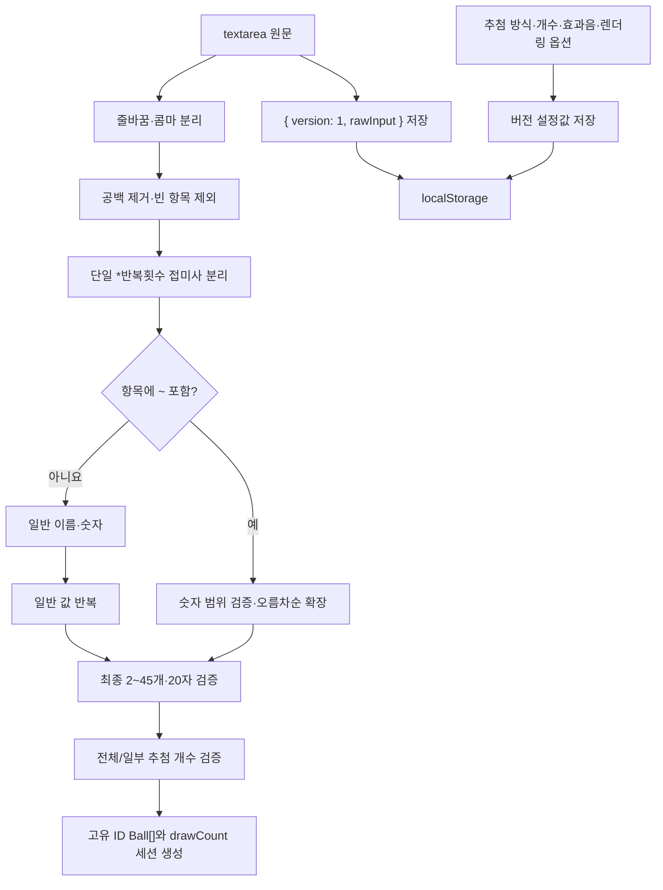

# Architecture

## 프로젝트 개요

로또 추첨기는 이름 목록, `민지*2` 같은 반복식과 `1~45` 같은 숫자 범위를 자유롭게 조합해 2~45개의 공으로 만들고 수동 또는 자동으로 전체 또는 지정한 개수만큼 순차 추첨하는 정적 React 웹앱이다. 같은 이름도 세션 내 고유 ID가 다른 별도 공으로 취급한다.

핵심 설계 목표는 다음과 같다.

- 추첨 결과의 정확성과 Canvas 2D·WebGL 3D 연출을 분리한다.
- 모든 무작위 결과와 자동 간격에 Web Crypto API만 사용한다.
- 서버나 외부 API 없이 브라우저 안에서 동작한다.
- 새로고침 후 이름 입력과 설정 옵션만 복원하고 추첨 세션은 새로 시작한다.
- 백그라운드 탭에서는 절대 예정 시각으로 누락 결과를 복구한다.

## 전체 아키텍처



React의 `App`이 화면 상태와 브라우저 수명주기를 조정한다. 추첨 규칙은 DOM이나 렌더링 API를 참조하지 않는 순수 도메인 모듈에 위치하며, Canvas 2D와 WebGL은 도메인 결과를 받아 시각화만 한다.

## 디렉터리 구조

```text
.
├── docs/
│   ├── architecture.md       # 현재 아키텍처 설명
│   ├── development.md        # 개발·테스트 가이드
│   ├── SPEC.md               # 제품·기술 요구사항
│   └── TASK.md               # 작업 상태와 진행 이력
├── src/
│   ├── components/
│   │   ├── DrawControls.tsx  # 다음 공, 재추첨, 설정 복귀 제어
│   │   ├── LotteryMachine.tsx      # 공통 운동과 2D·3D 렌더러 조정
│   │   ├── lottery3dRenderer.ts    # 단일 WebGL 장면·공 텍스처 렌더링
│   │   ├── lotteryMotion.ts        # 3축 혼합·정착·2D/3D 투영
│   │   ├── RenderModeToggle.tsx    # 설정·추첨 중 2D/3D 전환
│   │   ├── ResultList.tsx    # 누적 결과와 복사
│   │   ├── SetupPanel.tsx    # 입력·검증·개수·모드 설정
│   │   └── SoundToggle.tsx   # 효과음 토글
│   ├── domain/
│   │   ├── drawCount.ts      # 추첨 목표 개수 검증
│   │   ├── drawEngine.ts     # 추첨 세션과 상태 전이
│   │   ├── names.ts          # 이름 파싱·검증
│   │   ├── random.ts         # 안전한 난수·일정
│   │   └── types.ts          # 도메인 타입과 공 생성
│   ├── services/
│   │   ├── nameStorage.ts         # 입력 원문 영속화
│   │   ├── setupOptionsStorage.ts # 설정 옵션 영속화·검증
│   │   └── soundController.ts     # Web Audio 효과음
│   ├── test/setup.ts         # jsdom과 Canvas 테스트 환경
│   ├── App.tsx               # 앱 오케스트레이션
│   ├── index.css             # 반응형 디자인
│   └── main.tsx              # 브라우저 진입점
├── package.json              # 실행·검증 명령과 의존성
├── vite.config.ts            # 프로덕션·개발 빌드
└── vitest.config.ts          # jsdom 테스트 설정
```

테스트는 대상 모듈 옆의 `*.test.ts` 또는 `*.test.tsx` 파일에 둔다.

## 주요 모듈

| 모듈 | 책임 | 주요 입력 | 주요 출력·부작용 | 의존성 |
|---|---|---|---|---|
| `domain/names.ts` | 이름 분리, 반복식·숫자 범위 확장, 정규화·검증 | 입력 원문 | 이름 배열, 한국어 오류 배열 | 없음 |
| `domain/drawCount.ts` | 전체·일부 추첨 목표 검증 | 설정 방식, 입력값, 후보 수 | 목표 개수, 한국어 오류 배열 | `types.ts` |
| `domain/types.ts` | 도메인 타입과 공 생성 | 이름 배열 | 고유 ID와 색상을 가진 `Ball[]` | 없음 |
| `domain/random.ts` | 편향 없는 인덱스, 순열, 자동 일정 | 공 배열, 시작 시각, 난수 소스 | 공 ID 순열, `ScheduledDraw[]` | Web Crypto |
| `domain/drawEngine.ts` | 수동·자동 상태 전이와 비복원 결과 | `DrawSession`, 현재 시각 | 새 `DrawSession` | `random.ts`, `types.ts` |
| `services/nameStorage.ts` | 입력 원문 저장·복원·삭제 | 원문, Storage 어댑터 | 값과 경고를 포함한 결과 | `localStorage` |
| `services/setupOptionsStorage.ts` | 추첨·개수·효과음·렌더링 설정 저장·검증·복원 | `SetupOptions`, Storage 어댑터 | 설정값과 경고를 포함한 결과 | `localStorage`, `types.ts` |
| `services/soundController.ts` | 음소거, 단발 결과음과 지속형 바람·충돌음 수명 관리 | 사운드 이벤트, 혼합 여부, 남은 공 수 | Web Audio 노드·충돌 타이머 | AudioContext |
| `components/lotteryMotion.ts` | 3축 초기 배치·구형 경계·회전 난류·중앙 횡단·중력 적층·2D/3D 투영 | 공 목록, 상태, 시각, 구 반지름 | 운동 노드, 투영 좌표 | 없음 |
| `components/lottery3dRenderer.ts` | 세션 공 아틀라스와 경계 패킹 정적 장면을 재사용 정점 버퍼·한 draw call로 합성 | 전체 공, 3D 투영·배출 좌표, 장면 페인터·경계 | 단일 WebGL 프레임 | Canvas 2D, WebGL |
| `components/LotteryMachine.tsx` | 지속형 렌더러와 공통 운동 노드, 2D 정적 캐시, 유휴 중단, 실패 대체 연출 조정 | 남은 공·전체 공, 렌더링 모드, 혼합·정착 상태, 배출 공 | Canvas 2D 또는 WebGL 프레임 | `lotteryMotion.ts`, `lottery3dRenderer.ts` |
| `components/RenderModeToggle.tsx` | 설정·추첨 화면의 렌더링 선택 | 현재 `RenderMode` | 2D/3D 변경 이벤트 | React |
| `App.tsx` | 사용자 이벤트·타이머·가시성·서비스 통합 | 입력·클릭·브라우저 이벤트 | 화면 상태와 알림 | 모든 하위 모듈 |

### 의존성 방향

`domain`은 React와 브라우저 UI를 참조하지 않는다. `services`는 브라우저 API를 얇게 감싸고 실패를 값이나 무해한 예외 처리로 변환한다. `components`는 도메인 타입을 읽지만 추첨 결과를 결정하지 않는다. 이 방향을 유지해야 핵심 정확성을 Canvas나 UI 없이 테스트할 수 있다.

## 상태와 실행 흐름

### 수동 추첨



수동 세션은 첫 버튼 전과 공 사이의 `ready`, 결과 확정 대기인 `mixing` 상태 모두 Canvas 혼합을 유지한다. `beginManualDraw`는 `ready` 상태이면서 결과 수가 `drawCount`보다 작을 때만 동작하므로 연속 클릭이 같은 공을 두 번 처리하지 않는다. 선택된 공은 2.4초 후 결과에 반영되며 목표 개수에 도달하면 미추첨 후보가 남아 있어도 완료하고, 잔여 공은 중력 정착으로 전환한다.

### 자동 추첨

1. 시작 시 전체 공 순서를 암호학적으로 섞고 앞에서 `drawCount`개만 선택한다.
2. 선택한 공마다 3~7초의 정수 간격을 생성해 절대 `dueAt` 목록을 만든다.
3. 화면이 보이면 Canvas는 계속 혼합하고 가장 가까운 예정 시각에 결과를 반영한다.
4. 탭 복귀·포커스 또는 지연된 타이머 실행 시 `reconcileScheduledDraws`가 `now` 이전 일정을 한 번에 반영한다.
5. 한 번에 여러 공이 복구되면 놓친 배출 연출과 소리는 재생하지 않는다.

`reconcileScheduledDraws`는 이미 결과에 포함된 공 ID를 제외하므로 반복 호출해도 결과가 중복되지 않는다.

### 혼합 효과음

`App`은 Canvas와 같은 `shouldMixMachine` 판정을 사용해 효과음이 활성화된 수동 `ready`·`mixing` 또는 자동 `running` 상태에서 `SoundController.startMixing(remainingBallCount)`을 호출한다. 완료·오류·설정 복귀와 음소거에서는 `stopMixing()`으로 전환한다. 공 하나가 빠질 때마다 남은 공 수만 갱신하고 이미 실행 중인 바람 루프를 다시 만들지 않는다.

`SoundController`는 저주파 노이즈 버퍼를 필터링한 바람음을 하나의 반복 `AudioBufferSourceNode`로 유지한다. 바람·충돌 노이즈 버퍼는 같은 `AudioContext` 수명 동안 재사용한다. 짧은 노이즈와 삼각파 공명을 조합한 충돌음은 별도 타이머로 불규칙하게 생성하며, 남은 공이 많을수록 평균 간격을 줄인다. 남은 공이 1개 이하이면 예약된 충돌 타이머를 취소하고 2개 이상으로 늘어나면 다시 예약한다. 각 충돌이 끝나면 해당 소스·필터·공명·게인 노드 연결을 즉시 해제해 장시간 혼합의 GC 부담을 제한한다. 이 타이머에서 사용하는 `Math.random()`은 음향 변화에만 쓰고 `DrawEngine`, Web Crypto 난수와 자동 일정에는 전달하지 않는다.

### 재추첨과 설정 복귀

`redrawSession`은 현재 세션의 전체 후보 공, 수동·자동 모드와 목표 개수를 `createDrawSession`에 다시 전달해 결과·남은 공·대기 중 선택과 자동 일정을 모두 초기화한다. 수동 모드는 `ready`, 자동 모드는 새 절대 일정의 `running` 상태로 시작하며 설정 화면은 표시하지 않는다. `App`은 동시에 직전 배출 공과 결과 개수 추적값을 비워 이전 연출이 새 세션에 남지 않게 한다.

React effect 정리 함수는 재추첨으로 세션 객체가 교체될 때 기존 수동 완료 타이머, 자동 예약 타이머와 가시성 구독을 취소한다. 반면 `resetDrawSession`은 세션을 `null`로 바꿔 입력과 설정을 수정할 수 있는 설정 화면으로 돌아간다.

## 데이터 흐름

### 입력과 저장



입력은 `lottery-draw:names:v1`, 설정은 `lottery-draw:setup-options:v1` 키에 각각 버전 값으로 저장한다. 입력은 확장 배열이 아니라 `1~5, 민지*2, 7` 같은 원문을 저장하고, 설정은 추첨 방식·전체/일부 선택·일부 개수·효과음·2D/3D 렌더링 상태를 저장한다. 저장된 렌더링 선택이 없거나 기존 v1 설정에 렌더링 필드가 없으면 다른 값을 유지하면서 기본 3D로 복원한다. 새로고침 시 이 값들만 복원하며 일정·남은 공·결과·완료 상태는 복원하지 않는다.

### 추첨 결과

`DrawSession.drawCount`는 시작 시 확정한 목표 개수다. 결과 수가 이 값에 도달하면 완료하며, 일부 추첨에서는 `remainingBallIds`에 미추첨 후보가 남는다. `DrawResult`는 순서, 공 ID, 전체 이름, 추첨 시각을 가진다. 결과 목록은 전체 이름을 표시하고, Canvas만 공간에 맞춰 말줄임표를 사용한다. 복사 시 결과를 `1. 이름` 형식의 줄 단위 텍스트로 변환한다.

### 공통 운동과 2D·3D 투영

`lotteryMotion`의 공 노드는 Canvas 중심 기준 상대 `x`, `y`, `z` 좌표와 `vx`, `vy`, `vz` 속도를 가진다. 혼합 상태에서는 복수 회전축과 시간 기반 난류를 적용하고 구형 경계 법선으로 바깥쪽 속도를 반사한다. 공마다 위상이 다른 횡단 목표점이 구의 양쪽을 왕복하며, 중앙 근처에서는 회전보다 목표점 추종과 횡단 제트가 강해져 공이 중심을 통과한다. 공 간 충돌 해소는 하지 않는다.

2D 모드의 `projectBallMotionNode`는 `z`를 좌표 원근 배율과 투명도로 변환하되 모든 공의 반지름과 이름 글자 크기는 동일하게 유지하고 깊이가 낮은 공부터 그린다. 따라서 기존의 평면 로또 방송 스타일과 자연스러운 겹침을 보존한다.

3D 모드의 `projectBallMotionNode3d`는 카메라 거리로 원근 배율을 계산해 앞쪽 공을 더 크게 표시한다. `lottery3dRenderer`는 세션의 전체 공을 128px 셀의 로컬 Canvas 텍스처 아틀라스에 한 번 만들고, 남은 공만 깊이순 WebGL 빌보드로 배치한다. 45개에서는 사용하지 않는 빈 행을 제외한 1,024×768 아틀라스를 사용하며, 공이 빠져도 텍스처를 다시 만들지 않는다.

외곽선 없는 유리구·면 반사·3D 받침·접촉 및 바닥 그림자는 리사이즈 때만 배경/전경 정적 장면 텍스처로 갱신한다. 두 레이어는 전체 Canvas가 아니라 안티앨리어싱 여백을 포함한 실제 도형 경계만 하나의 아틀라스에 세로로 패킹한다. 프레임에서는 경계 크기의 배경, 깊이순 공, 유리 전경, 배출 공 쿼드를 미리 할당한 `Float32Array`와 WebGL 버퍼에 기록하고 `bufferSubData`와 한 번의 draw call로 합성한다. 깊이 순서는 운동 투영 단계에서 한 번만 정렬한다.

`LotteryMachine`의 WebGL 프로그램·텍스처·ResizeObserver·애니메이션 루프 수명은 `renderMode`에만 연결한다. 남은 공, 혼합·정착 여부와 배출 공은 ref로 최신 값을 전달하므로 추첨 단계가 바뀌어도 셰이더, 정적 장면과 공 아틀라스를 폐기하거나 다시 업로드하지 않는다. WebGL 컨텍스트는 CPU 정렬과 알파 텍스처로 사용하지 않는 깊이·스텐실·멀티샘플 버퍼를 요청하지 않는다.

2D 모드도 구·받침 배경과 고정 외곽선을 도형 경계 크기의 고해상도 Canvas에 리사이즈 때 한 번 만든다. 프레임에서는 이 정적 레이어를 복사하고 움직이는 공·잔상·혼합 강조선·배출 공만 다시 그린다.

정상 3D 경로에는 보이는 WebGL Canvas 하나만 사용한다. WebGL 생성·실행이 실패하거나 context가 유실될 때만 숨겨 둔 Canvas 대체 경로를 활성화해 같은 3D 투영 좌표와 장면을 그린다. 두 모드는 `nodesRef`의 같은 `BallMotionNode`를 공유하며, `renderMode` 변경은 렌더링 리소스만 다시 구성하므로 현재 공 위치, `DrawSession`, 결과와 자동 일정은 유지된다.

일부 추첨 완료 시 `App`은 남은 공이 있는 경우에만 `isSettling`을 전달한다. `LotteryMachine`은 혼합 운동 대신 아래 방향 중력과 구형 벽 반발을 적용하고, 3회 반복하는 공 간 위치 보정·저반발 충돌·마찰로 남은 공을 바닥에 쌓는다. 모든 공의 프레임 간 이동이 0.08 CSS px 이하인 상태가 18프레임 이어지면 마지막 화면을 유지한 채 `requestAnimationFrame`을 중단한다. 남은 공과 배출 공이 없을 때도 첫 정적 프레임 뒤 중단하며, 상태·공·크기가 바뀌면 즉시 재개한다.

## 정확성과 실패 격리

- `secureRandomIndex`는 32비트 난수 범위를 목표 길이로 나눌 때 남는 편향 구간을 거부하고 다시 추출한다.
- Web Crypto 실패는 비보안 난수로 대체하지 않고 세션을 `error` 상태로 전환한다.
- Canvas·WebGL 프레임 저하나 오류는 도메인 결과와 일정을 바꾸지 않는다.
- WebGL 생성·렌더링·context 유실은 경고와 Canvas 대체 연출로 격리한다.
- 입력 또는 설정 저장 실패는 현재 메모리 상태를 유지한 채 경고한다.
- Clipboard 실패는 오류 알림만 표시한다.
- Web Audio 생성·재개·노드 실패는 바람·충돌 타이머를 정리하고 소리 없이 추첨을 계속한다.

## 외부 의존성

### 런타임

| 의존성 | 용도 | 네트워크 통신 |
|---|---|---|
| React, React DOM | UI 렌더링과 상태 관리 | 없음 |
| Web Crypto API | 결과 순서와 자동 간격 난수 | 없음 |
| Canvas 2D | 2D 연출, 3D 정적 장면·공 텍스처 생성과 실패 대체 | 없음 |
| WebGL | 단일 3D 장면 합성과 원근 공 렌더링 | 없음 |
| localStorage | 입력 원문과 설정 옵션 저장 | 없음 |
| Clipboard API | 결과 복사 | 없음 |
| Web Audio API | 선택적 효과음 | 없음 |

서버, 데이터베이스, 원격 분석 도구, 외부 폰트·이미지·스크립트를 사용하지 않는다.

### 개발

Vite가 개발 서버와 정적 번들을 만들고, TypeScript가 타입을 검사하며, Vitest·Testing Library·jsdom이 자동 테스트를 실행한다.

## 확장성과 유지보수 고려사항

- **46개 이상 공 확장:** Canvas·WebGL 공 반지름, 텍스처 아틀라스, 3축 운동 계산량과 모바일 높이를 함께 재검증해야 한다.
- **고급 3D 확장:** 현재 단일 장면의 빌보드 공을 메시 기반 구체·광원·회전 물리로 바꾸더라도 정적 장면 캐시와 `DrawEngine` 결과 격리를 유지해야 한다.
- **렌더링 성능 확장:** 최대 공 수나 장면 도형을 늘릴 때는 세션 단위 텍스처 수명, 도형 경계 패킹, 재사용 정점 버퍼와 안정 후 애니메이션 중단 계약을 유지하고 GPU 메모리·프레임 시간을 다시 측정한다.
- **결과 저장:** 이름 저장소와 분리된 버전형 저장소를 추가하고 개인정보 노출 정책을 먼저 정한다.
- **배포:** 현재 `dist/`는 정적 산출물이다. 호스팅별 base path와 CI 설정은 별도 범위다.
- **브라우저:** Chromium 실제 검수는 완료했으나 Safari·Firefox·Edge는 대상 환경에서 추가 실행 검수가 필요하다.
- **상태 복잡도 증가:** 기능이 커지면 `App`의 타이머·알림·세션 조정을 전용 훅 또는 reducer로 이동한다.
- **문서 갱신:** 도메인 계약, 저장 형식, 상태 흐름이 바뀌면 이 문서와 `docs/SPEC.md`, `docs/TASK.md`를 함께 갱신한다.
