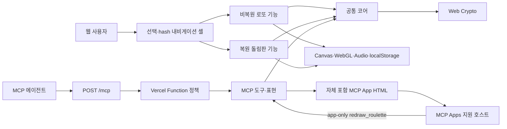
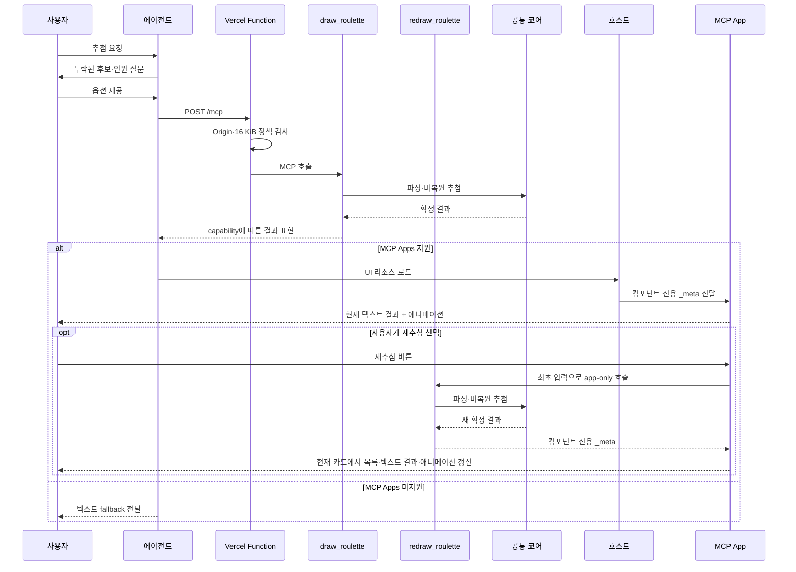

# Architecture

## 프로젝트 개요

프로젝트는 정적 React 웹앱과 공개 Remote MCP 서버로 추첨 기능을 제공한다. 웹은 비복원 로또와 복원 돌림판을 선택하는 얇은 셸을 두고 각 추첨기의 도메인·UI·서비스를 수직 기능 단위로 격리한다. MCP는 기존 비복원 추첨 계약을 stateless 도구와 별도 MCP App UI로 제공한다.

설계 원칙은 다음과 같다.

- 후보 파싱, Web Crypto 난수와 선택적인 비복원 즉시 추첨만 `src/core`에서 공유한다.
- 로또와 돌림판은 공통 세션 계약을 만들지 않고 서로 import하지 않는다.
- 웹 셸은 기능 공개 진입점만 마운트하며 내부 상태를 읽거나 변경하지 않는다.
- 웹, MCP App UI와 MCP 서버 런타임 코드는 독립적으로 빌드한다.
- 추첨 결과와 시각적 연출을 분리한다.
- MCP는 후보·결과를 저장하거나 애플리케이션 로그로 남기지 않는다.
- 서버 오류 시 `Math.random()`으로 대체하지 않는다.

## 전체 아키텍처



상위 의존성 방향은 `web → core ← mcp ← api`다. 웹 내부에서는 `App → features/* → core`만 허용하고, 셸은 기능별 `index.ts` 공개 진입점만 참조한다. MCP App은 별도 소스에서 단일 HTML로 빌드되고 MCP에는 생성 리소스만 포함된다. `core`는 상위 제품을 모른다.

## 디렉터리 구조

```text
.
├── api/
│   └── mcp.ts                       # 유일한 Vercel Web Request 진입점
├── src/
│   ├── core/
│   │   ├── input.ts                 # 후보 문법 파싱과 제한 검증
│   │   ├── random.ts                # 거부 샘플링과 Fisher–Yates
│   │   ├── draw.ts                  # stateless 즉시 추첨
│   │   └── types.ts                 # 공통 후보·결과 타입
│   ├── web/
│   │   ├── App.tsx                  # 선택·hash 내비게이션·기능 마운트
│   │   ├── ExperienceErrorBoundary.tsx
│   │   ├── experience.ts            # 표시 메타데이터와 hash 계약
│   │   ├── experienceStorage.ts     # 마지막 선택 전용 저장소
│   │   ├── shell.css                # 셸 전용 스타일
│   │   ├── features/
│   │   │   ├── lottery/             # 비복원 세션·2D/3D UI·저장·음향
│   │   │   └── wheel/               # 복원 세션·SVG UI·저장·음향
│   │   └── main.tsx                 # Vite 진입점
│   ├── mcp-apps/
│   │   └── roulette/                # 격리된 MCP Apps UI와 생성 리소스
│   └── mcp/
│       ├── server.ts                # 서버 정보·지침·도구 등록
│       ├── errors.ts                # 안전한 공개 오류 매핑
│       ├── http/requestPolicy.ts    # Origin·본문 크기·보안 헤더
│       ├── integration/             # 실제 MCP 클라이언트 통합 테스트
│       ├── resources/rouletteApp.ts # 생성 HTML 리소스 등록
│       └── tools/drawRoulette.ts    # Zod 계약과 실행 조정
├── docs/feature/                     # 기능별 스펙·설계·작업·검증 문서
├── tools/remote-mcp/                 # 로컬 실행·경계·Vercel 검증 도구
├── tsconfig.base.json
├── tsconfig.web.json
├── tsconfig.mcp.json
├── tsconfig.mcp-app.json
├── vitest.web.config.ts
├── vitest.mcp.config.ts
├── vitest.mcp-app.config.ts
└── vercel.json
```

테스트는 대상 모듈 옆에 둔다. 목적별 TypeScript·Vitest 설정은 포함 경계를 명시하며, `verify-boundaries.mjs`가 import와 산출물 경계를 별도로 검사한다.

## 주요 모듈과 책임

| 모듈 | 책임 | 의존 가능 범위 |
|---|---|---|
| `src/core/input.ts` | 콤마·줄바꿈·반복·범위 파싱, 2~45개·20자 제한 | 표준 JavaScript만 |
| `src/core/random.ts` | Web Crypto 난수, 모듈러 편향 없는 인덱스, 순열 | Web Crypto만 |
| `src/core/draw.ts` | 후보 배열의 즉시 비복원 추첨 | `core`만 |
| `src/web/App.tsx` | 선택 화면, hash history, 공개 기능 마운트와 최상위 오류 격리 | 기능별 `index.ts`, 셸 모듈 |
| `src/web/features/lottery/*` | 비복원 세션, 수동·자동 일정, 2D·3D 렌더링, 로또 저장·음향·결과 | `core`, 브라우저 API |
| `src/web/features/wheel/domain/*` | 복원 세션, 고유 outcome, 후보 구획과 목표 회전각 | `core` |
| `src/web/features/wheel/components/*` | SVG 돌림판, 설정·제어·전체 후보·결과 이력 | wheel 내부, 브라우저 API |
| `src/web/features/wheel/services/*` | 돌림판 후보·옵션 저장과 회전·당첨 효과음 | wheel 내부, 브라우저 API |
| `src/mcp-apps/roulette/*` | 최초 입력·결과 검증, app-only 재추첨 호출, 현재 카드의 룰렛 회전과 순차 공개 | MCP Apps 브리지, DOM |
| `src/mcp/tools/drawRoulette.ts` | 엄격한 입력·출력 스키마, 코어 호출, 오류 변환 | `core`, `mcp`, MCP SDK, Zod |
| `src/mcp/resources/rouletteApp.ts` | 생성된 단일 HTML을 현재 버전 `ui://` 리소스와 과거 버전 호환 템플릿으로 등록 | 생성 리소스, MCP SDK |
| `src/mcp/server.ts` | 초기화 지침, 모델용 `draw_roulette`, app-only `redraw_roulette`, UI 메타데이터 등록 | `mcp`, MCP SDK |
| `src/mcp/http/requestPolicy.ts` | same-origin 검사, 16 KiB 제한, `no-store`·`nosniff` | Web Request/Response |
| `api/mcp.ts` | `mcp-handler`와 정책을 결합한 Vercel Function | `api`, `mcp` |
| `tools/remote-mcp/local-mcp-server.ts` | 개발 서버 이름 주입과 payload 비포함 HTTP 요청 로그 | Node HTTP, `api`, `mcp` |

클래스와 모듈의 독립 책임은 코드 주석으로도 명시한다. 새 추상화는 이 경계를 유지하는 데 필요한 경우에만 추가한다.

## 실행 흐름

### 웹 추첨

1. `App`은 `#/`, `#/lottery`, `#/wheel`을 해석하고 선택한 기능의 공개 컴포넌트만 마운트한다.
2. 로또는 공통 파서와 Web Crypto 순열로 비복원 순서를 확정한 뒤 수동 또는 절대 일정 기반 자동 흐름으로 공개한다.
3. 돌림판은 회전 시작 시 `secureRandomIndex`로 목표 후보를 확정하고, 순수 각도 계산 결과까지 SVG 그룹을 약 4초간 회전시킨다.
4. 돌림판 완료는 애니메이션 이벤트가 아니라 절대 `revealAt`과 outcome ID로 한 번만 반영한다. 당첨 후보는 제거하지 않는다.
5. 각 기능은 입력·옵션만 자신의 `localStorage` 키에 저장한다. 세션, 결과와 누적 회전각은 저장하지 않는다.

### Remote MCP 추첨



각 도구 호출은 검증부터 결과 반환까지 독립적으로 완결된다. UI는 결과를 직접 만들지 않으며 재추첨 시에만 최초 입력으로 app-only `redraw_roulette`를 호출한다. 반환값은 기존 iframe이 소비해 같은 카드의 애니메이션을 다시 실행하고, 사용자 메시지나 별도 에이전트 답변은 만들지 않는다. 서버는 세션 ID, 후보, 전체 순열 또는 결과를 다음 요청에 유지하지 않는다. GET·DELETE 세션 연산은 stateless 정책에 따라 허용하지 않는다. 운영 Vercel 처리기는 기본 서버 식별자를 사용하고, 로컬 실행기는 같은 처리기 팩터리에 개발 식별자만 주입해 두 환경의 도구 계약을 동일하게 유지한다.

## 데이터와 신뢰 경계

| 데이터 | 웹 | MCP |
|---|---|---|
| 후보 원문 | 로또·돌림판 전용 `localStorage` 키에 각각 저장 | 요청 처리 중 메모리에서만 사용 |
| 추첨 결과 | 화면 상태에만 유지 | 응답에만 포함 |
| 로그 | 웹 런타임 오류 처리 | 후보·결과·본문을 기록하지 않음 |
| 영속 서버 저장소 | 없음 | 없음 |

공개 MCP는 인증하지 않으므로 인터넷의 임의 클라이언트가 호출할 수 있다. 애플리케이션은 Origin이 있는 요청에 same-origin 정책과 16 KiB 본문 제한을 적용하지만, 비브라우저 MCP 클라이언트 호환성을 위해 Origin이 없는 요청은 허용한다. 이 정책은 인증이나 완전한 남용 방지 수단이 아니다.

## 빌드 경계

- `tsconfig.web.json`: `src/core`, `src/web`만 검사한다.
- `tsconfig.mcp-app.json`: `src/mcp-apps` UI 소스와 빌드 설정만 검사한다.
- `tsconfig.mcp.json`: `src/core`, `src/mcp`, `api`만 검사한다.
- Vite 진입점은 `src/web/main.tsx`이며 MCP SDK에 도달하지 않는다.
- MCP App Vite 빌드는 외부 자산 없는 단일 HTML을 만들고 생성 모듈로 변환한다.
- Vercel Function 진입점은 `api/mcp.ts`이며 생성 UI 리소스는 포함하지만 React·Canvas·WebGL·웹 서비스나 MCP App 실행 소스에 도달하지 않는다.
- 웹 빌드는 기존 GitHub Pages의 `/roulette/` 정적 경로를 유지한다.
- Vercel 프로젝트는 `api/mcp.ts` Function만 빌드하며 `dist` 정적 웹을 배포하지 않는다.
- `verify:boundaries`는 기능 간 교차 import, 기능에서 셸로의 역방향 import, 셸의 기능 내부 접근과 기존 제품·번들 경계를 함께 검사한다.

## 외부 의존성과 인프라

- React·Vite: 정적 웹 UI와 번들
- MCP TypeScript SDK 2·`mcp-handler`: 표준 Streamable HTTP 서버와 클라이언트 테스트
- MCP Apps·MCP-UI: 표준 UI 브리지와 단일 HTML 리소스 생성
- Zod: MCP 입력·출력 스키마
- Vercel Function·rewrite: 공개 `/mcp` 진입점만 제공
- Vitest·Testing Library·jsdom: 코어, 웹, MCP App, MCP 검증

데이터베이스, KV, 캐시, 원격 분석 도구와 외부 미디어 자산은 사용하지 않는다. Remote MCP의 실제 배포 상태와 검증 기록은 `docs/feature/remote-mcp` 문서를 기준으로 확인한다.

## 확장 지점

- 새 웹 추첨기는 독립적인 `src/web/features/<type>`와 공개 `index.ts`를 만들고 `experience.ts` 메타데이터, `App.tsx`의 명시적 마운트 분기만 추가한다. 기존 기능의 세션·저장소·UI 계약은 확장하지 않는다.
- 두 기능에서 실제로 동일한 책임과 변경 이유가 확인될 때만 작은 공통 모듈을 승격한다. 현재 웹 공통 UI·서비스 계층은 두지 않는다.
- MCP Apps capability를 협상한 호스트와 ChatGPT UI 호출에는 결과를 컴포넌트 전용 `_meta`로만 전달하고, 비지원 호스트에는 텍스트 `content`와 `structuredContent`를 전달한다. App은 `_meta`를 우선하며 capability가 유실된 기존 호출의 `structuredContent`도 읽되, UI에 이미 보이는 결과를 모델 컨텍스트에 다시 추가하지 않는다.
- 인증·사용량 제한이 필요하면 Function 앞단 정책으로 추가하되 코어 추첨 규칙은 변경하지 않는다.
- 새 MCP 도구는 `src/mcp/tools`에 추가하고 `server.ts`에서 명시적으로 등록한다.
- 공통 코어를 별도 패키지로 분리하는 것은 독립 배포·버전 요구가 생길 때만 고려한다.
