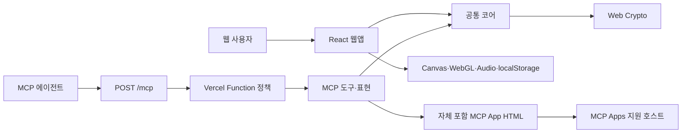
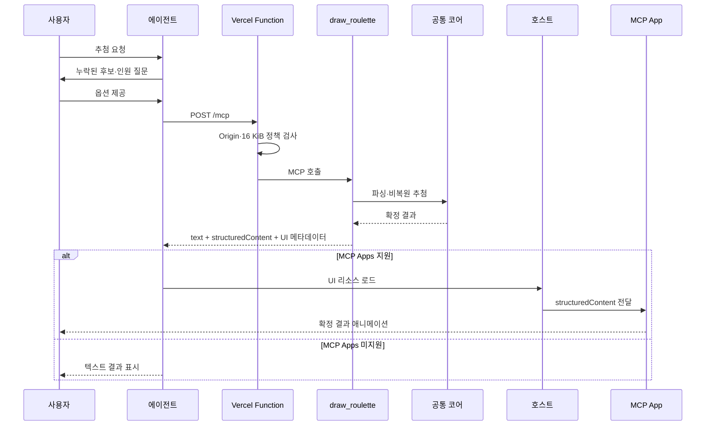

# Architecture

## 프로젝트 개요

로또 추첨기는 하나의 공통 추첨 규칙을 정적 React 웹앱과 공개 Remote MCP 서버로 제공한다. 웹은 브라우저 안에서 수동·자동 추첨과 2D·3D 연출을 담당한다. MCP는 에이전트가 수집한 옵션을 한 번의 stateless 호출로 검증·추첨해 텍스트와 구조화 결과를 반환하고, MCP Apps 지원 호스트에는 확정 결과를 애니메이션하는 별도 UI 리소스를 제공한다.

설계 원칙은 다음과 같다.

- 후보 파싱, Web Crypto 난수와 즉시 추첨만 `src/core`에서 공유한다.
- 웹, MCP App UI와 MCP 서버 런타임 코드는 독립적으로 빌드한다.
- 추첨 결과와 시각적 연출을 분리한다.
- MCP는 후보·결과를 저장하거나 애플리케이션 로그로 남기지 않는다.
- 서버 오류 시 `Math.random()`으로 대체하지 않는다.

## 전체 아키텍처



의존성 방향은 `web → core ← mcp ← api`다. MCP App은 별도 소스에서 단일 HTML로 빌드되고 MCP에는 생성 리소스만 포함된다. `core`는 상위 제품을 모르며, `web`, MCP App 실행 코드와 `mcp` 사이에는 직접 런타임 의존성이 없다.

## 디렉터리 구조

```text
.
├── api/
│   └── mcp.ts                       # 유일한 Vercel Web Request 진입점
├── src/
│   ├── core/
│   │   ├── input.ts                 # 후보 문법 파싱과 제한 검증
│   │   ├── random.ts                # 거부 샘플링과 Fisher–Yates
│   │   ├── draw.ts                  # stateless 즉시 추첨
│   │   └── types.ts                 # 공통 후보·결과 타입
│   ├── web/
│   │   ├── components/              # React UI, Canvas 2D, WebGL 3D
│   │   ├── domain/                  # 웹 세션·일정·표시용 공 타입
│   │   ├── services/                # localStorage·오디오·이미지
│   │   ├── App.tsx                  # 웹 상태와 수명주기 조정
│   │   └── main.tsx                 # Vite 진입점
│   ├── mcp-apps/
│   │   └── roulette/                # 격리된 MCP Apps UI와 생성 리소스
│   └── mcp/
│       ├── server.ts                # 서버 정보·지침·도구 등록
│       ├── errors.ts                # 안전한 공개 오류 매핑
│       ├── http/requestPolicy.ts    # Origin·본문 크기·보안 헤더
│       ├── integration/             # 실제 MCP 클라이언트 통합 테스트
│       ├── resources/rouletteApp.ts # 생성 HTML 리소스 등록
│       ├── tools/drawRoulette.ts    # Zod 계약과 실행 조정
│       └── presentation/textResult.ts
├── docs/feature/remote-mcp/          # 기능 스펙·작업·검증 문서
├── tools/remote-mcp/                 # 로컬 실행·경계·Vercel 검증 도구
├── tsconfig.base.json
├── tsconfig.web.json
├── tsconfig.mcp.json
├── tsconfig.mcp-app.json
├── vitest.web.config.ts
├── vitest.mcp.config.ts
├── vitest.mcp-app.config.ts
└── vercel.json
```

테스트는 대상 모듈 옆에 둔다. 목적별 TypeScript·Vitest 설정은 포함 경계를 명시하며, `verify-boundaries.mjs`가 import와 산출물 경계를 별도로 검사한다.

## 주요 모듈과 책임

| 모듈 | 책임 | 의존 가능 범위 |
|---|---|---|
| `src/core/input.ts` | 콤마·줄바꿈·반복·범위 파싱, 2~45개·20자 제한 | 표준 JavaScript만 |
| `src/core/random.ts` | Web Crypto 난수, 모듈러 편향 없는 인덱스, 순열 | Web Crypto만 |
| `src/core/draw.ts` | 후보 배열의 즉시 비복원 추첨 | `core`만 |
| `src/web/domain/*` | 수동·자동 세션, 3~7초 일정, 웹 표시 타입 | `core`, `web` |
| `src/web/components/*` | 설정, 결과, 2D·3D 운동과 렌더링 | `core`, `web`, 브라우저 API |
| `src/web/services/*` | 입력·설정 저장, 이미지, 효과음 | `web`, 브라우저 API |
| `src/mcp-apps/roulette/*` | 호스트의 최종 결과 검증, 룰렛 회전과 순차 공개 | MCP Apps 브리지, DOM |
| `src/mcp/tools/drawRoulette.ts` | 엄격한 입력·출력 스키마, 코어 호출, 오류 변환 | `core`, `mcp`, MCP SDK, Zod |
| `src/mcp/resources/rouletteApp.ts` | 생성된 단일 HTML을 버전 고정 `ui://` 리소스로 등록 | 생성 리소스, MCP SDK |
| `src/mcp/server.ts` | 초기화 지침과 `draw_roulette`, UI 메타데이터 등록 | `mcp`, MCP SDK |
| `src/mcp/http/requestPolicy.ts` | same-origin 검사, 16 KiB 제한, `no-store`·`nosniff` | Web Request/Response |
| `api/mcp.ts` | `mcp-handler`와 정책을 결합한 Vercel Function | `api`, `mcp` |

클래스와 모듈의 독립 책임은 코드 주석으로도 명시한다. 새 추상화는 이 경계를 유지하는 데 필요한 경우에만 추가한다.

## 실행 흐름

### 웹 추첨

1. `App`이 입력을 공통 파서로 검증하고 웹 표시용 공을 만든다.
2. 웹 세션 엔진이 Web Crypto 순열과 추첨 일정을 확정한다.
3. 수동 모드는 사용자 입력 후, 자동 모드는 절대 예정 시각에 결과를 반영한다.
4. `LotteryMachine`은 결과를 결정하지 않고 남은 공과 선택 공을 시각화한다.
5. 이름 원문과 옵션만 `localStorage`에 저장하며 진행 결과는 저장하지 않는다.

### Remote MCP 추첨



도구 호출 하나가 검증부터 결과 반환까지 완결된다. UI는 결과를 새로 만들거나 도구를 재호출하지 않고 서버가 확정한 순서의 공개 시점만 연출한다. 서버는 세션 ID, 후보, 전체 순열 또는 결과를 다음 요청에 유지하지 않는다. GET·DELETE 세션 연산은 stateless 정책에 따라 허용하지 않는다.

## 데이터와 신뢰 경계

| 데이터 | 웹 | MCP |
|---|---|---|
| 후보 원문 | 브라우저 `localStorage`에 사용자 선택으로 저장 | 요청 처리 중 메모리에서만 사용 |
| 추첨 결과 | 화면 상태에만 유지 | 응답에만 포함 |
| 로그 | 웹 런타임 오류 처리 | 후보·결과·본문을 기록하지 않음 |
| 영속 서버 저장소 | 없음 | 없음 |

공개 MCP는 인증하지 않으므로 인터넷의 임의 클라이언트가 호출할 수 있다. 애플리케이션은 Origin이 있는 요청에 same-origin 정책과 16 KiB 본문 제한을 적용하지만, 비브라우저 MCP 클라이언트 호환성을 위해 Origin이 없는 요청은 허용한다. 이 정책은 인증이나 완전한 남용 방지 수단이 아니다.

## 빌드 경계

- `tsconfig.web.json`: `src/core`, `src/web`만 검사한다.
- `tsconfig.mcp-app.json`: `src/mcp-apps` UI 소스와 빌드 설정만 검사한다.
- `tsconfig.mcp.json`: `src/core`, `src/mcp`, `api`만 검사한다.
- Vite 진입점은 `src/web/main.tsx`이며 MCP SDK에 도달하지 않는다.
- MCP App Vite 빌드는 외부 자산 없는 단일 HTML을 만들고 생성 모듈로 변환한다.
- Vercel Function 진입점은 `api/mcp.ts`이며 생성 UI 리소스는 포함하지만 React·Canvas·WebGL·웹 서비스나 MCP App 실행 소스에 도달하지 않는다.
- 웹 빌드는 기존 GitHub Pages의 `/roulette/` 정적 경로를 유지한다.
- Vercel 프로젝트는 `api/mcp.ts` Function만 빌드하며 `dist` 정적 웹을 배포하지 않는다.

## 외부 의존성과 인프라

- React·Vite: 정적 웹 UI와 번들
- MCP TypeScript SDK 2·`mcp-handler`: 표준 Streamable HTTP 서버와 클라이언트 테스트
- MCP Apps·MCP-UI: 표준 UI 브리지와 단일 HTML 리소스 생성
- Zod: MCP 입력·출력 스키마
- Vercel Function·rewrite: 공개 `/mcp` 진입점만 제공
- Vitest·Testing Library·jsdom: 코어, 웹, MCP App, MCP 검증

데이터베이스, KV, 캐시, 원격 분석 도구와 외부 미디어 자산은 사용하지 않는다. 현재 저장소는 Vercel 배포 준비까지만 포함하며 실제 Preview·Production 배포 상태를 전제하지 않는다.

## 확장 지점

- MCP Apps 호스트별 기능 차이는 텍스트·구조화 결과 fallback으로 흡수한다.
- 인증·사용량 제한이 필요하면 Function 앞단 정책으로 추가하되 코어 추첨 규칙은 변경하지 않는다.
- 새 MCP 도구는 `src/mcp/tools`에 추가하고 `server.ts`에서 명시적으로 등록한다.
- 공통 코어를 별도 패키지로 분리하는 것은 독립 배포·버전 요구가 생길 때만 고려한다.
