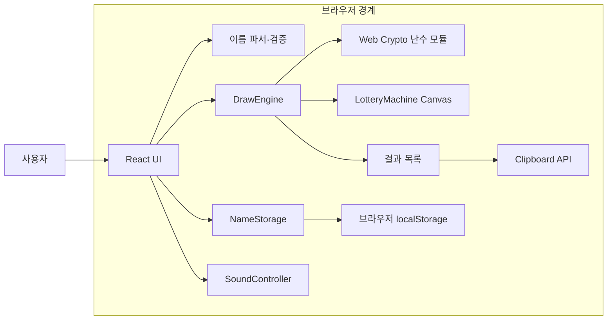
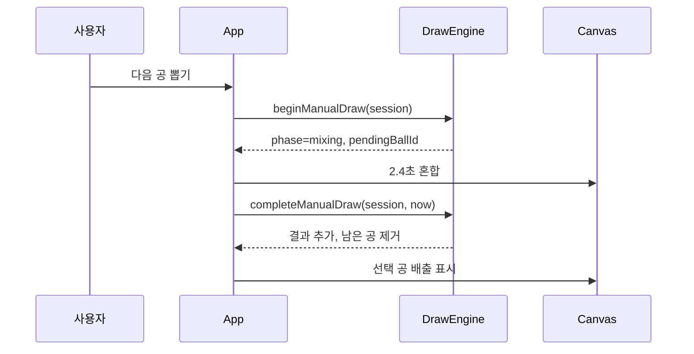
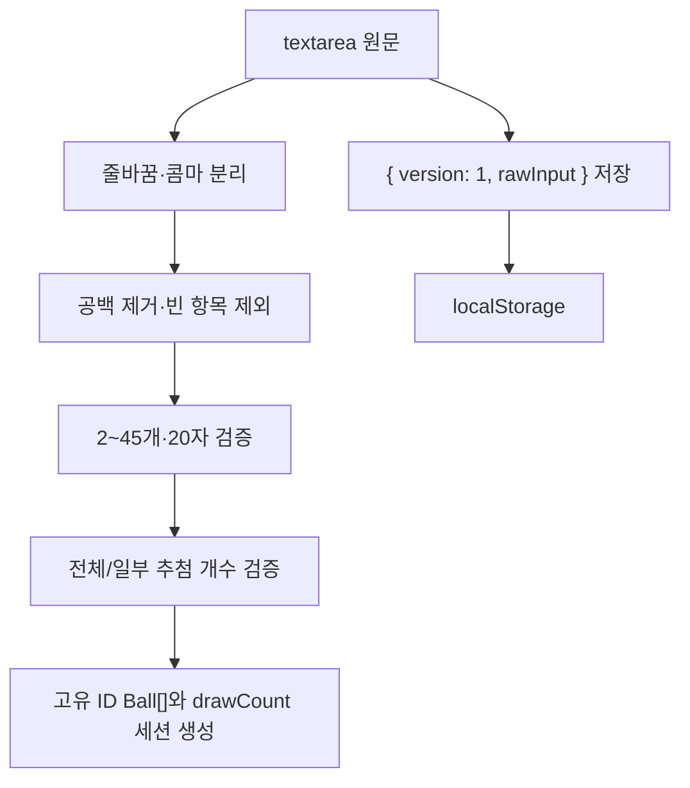

# Architecture

## 프로젝트 개요

로또 추첨기는 2~45개의 이름을 공으로 만들어 수동 또는 자동으로 전체 또는 지정한 개수만큼 순차 추첨하는 정적 React 웹앱이다. 같은 이름도 세션 내 고유 ID가 다른 별도 공으로 취급한다.

핵심 설계 목표는 다음과 같다.

- 추첨 결과의 정확성과 Canvas 연출을 분리한다.
- 모든 무작위 결과와 자동 간격에 Web Crypto API만 사용한다.
- 서버나 외부 API 없이 브라우저 안에서 동작한다.
- 새로고침 후 이름 입력만 복원하고 추첨 세션은 새로 시작한다.
- 백그라운드 탭에서는 절대 예정 시각으로 누락 결과를 복구한다.

## 전체 아키텍처



React의 `App`이 화면 상태와 브라우저 수명주기를 조정한다. 추첨 규칙은 DOM이나 Canvas를 참조하지 않는 순수 도메인 모듈에 위치하며, Canvas는 도메인 결과를 받아 시각화만 한다.

## 디렉터리 구조

```text
.
├── docs/
│   ├── architecture.md       # 현재 아키텍처 설명
│   ├── development.md        # 개발·테스트 가이드
│   ├── SPEC.md               # 제품·기술 요구사항
│   └── TASK.md               # 작업 상태와 진행 이력
├── src/
│   ├── components/
│   │   ├── DrawControls.tsx  # 수동/자동 상태별 제어
│   │   ├── LotteryMachine.tsx# Canvas 2D 연출
│   │   ├── ResultList.tsx    # 누적 결과와 복사
│   │   ├── SetupPanel.tsx    # 입력·검증·개수·모드 설정
│   │   └── SoundToggle.tsx   # 효과음 토글
│   ├── domain/
│   │   ├── drawCount.ts      # 추첨 목표 개수 검증
│   │   ├── drawEngine.ts     # 추첨 세션과 상태 전이
│   │   ├── names.ts          # 이름 파싱·검증
│   │   ├── random.ts         # 안전한 난수·일정
│   │   └── types.ts          # 도메인 타입과 공 생성
│   ├── services/
│   │   ├── nameStorage.ts    # 입력 원문 영속화
│   │   └── soundController.ts# Web Audio 효과음
│   ├── test/setup.ts         # jsdom과 Canvas 테스트 환경
│   ├── App.tsx               # 앱 오케스트레이션
│   ├── index.css             # 반응형 디자인
│   └── main.tsx              # 브라우저 진입점
├── package.json              # 실행·검증 명령과 의존성
├── vite.config.ts            # 프로덕션·개발 빌드
└── vitest.config.ts          # jsdom 테스트 설정
```

테스트는 대상 모듈 옆의 `*.test.ts` 또는 `*.test.tsx` 파일에 둔다.

## 주요 모듈

| 모듈 | 책임 | 주요 입력 | 주요 출력·부작용 | 의존성 |
|---|---|---|---|---|
| `domain/names.ts` | 이름 분리·정규화·검증 | 입력 원문 | 이름 배열, 한국어 오류 배열 | 없음 |
| `domain/drawCount.ts` | 전체·일부 추첨 목표 검증 | 설정 방식, 입력값, 후보 수 | 목표 개수, 한국어 오류 배열 | `types.ts` |
| `domain/types.ts` | 도메인 타입과 공 생성 | 이름 배열 | 고유 ID와 색상을 가진 `Ball[]` | 없음 |
| `domain/random.ts` | 편향 없는 인덱스, 순열, 자동 일정 | 공 배열, 시작 시각, 난수 소스 | 공 ID 순열, `ScheduledDraw[]` | Web Crypto |
| `domain/drawEngine.ts` | 수동·자동 상태 전이와 비복원 결과 | `DrawSession`, 현재 시각 | 새 `DrawSession` | `random.ts`, `types.ts` |
| `services/nameStorage.ts` | 입력 원문 저장·복원·삭제 | 원문, Storage 어댑터 | 값과 경고를 포함한 결과 | `localStorage` |
| `services/soundController.ts` | 음소거 상태와 효과음 재생 | 사운드 이벤트 | Web Audio 출력 | AudioContext |
| `components/LotteryMachine.tsx` | 공 이동·충돌·배출 시각화 | 남은 공, 혼합 상태, 배출 공 | Canvas 프레임 | Canvas 2D |
| `App.tsx` | 사용자 이벤트·타이머·가시성·서비스 통합 | 입력·클릭·브라우저 이벤트 | 화면 상태와 알림 | 모든 하위 모듈 |

### 의존성 방향

`domain`은 React와 브라우저 UI를 참조하지 않는다. `services`는 브라우저 API를 얇게 감싸고 실패를 값이나 무해한 예외 처리로 변환한다. `components`는 도메인 타입을 읽지만 추첨 결과를 결정하지 않는다. 이 방향을 유지해야 핵심 정확성을 Canvas나 UI 없이 테스트할 수 있다.

## 상태와 실행 흐름

### 수동 추첨



`beginManualDraw`는 `ready` 상태이면서 결과 수가 `drawCount`보다 작을 때만 동작하므로 연속 클릭이 같은 공을 두 번 처리하지 않는다. 선택된 공은 혼합 종료 후 결과에 반영되며 목표 개수에 도달하면 미추첨 후보가 남아 있어도 완료한다.

### 자동 추첨

1. 시작 시 전체 공 순서를 암호학적으로 섞고 앞에서 `drawCount`개만 선택한다.
2. 선택한 공마다 5~10초의 정수 간격을 생성해 절대 `dueAt` 목록을 만든다.
3. 화면이 보이면 Canvas는 계속 혼합하고 가장 가까운 예정 시각에 결과를 반영한다.
4. 탭 복귀·포커스 또는 지연된 타이머 실행 시 `reconcileScheduledDraws`가 `now` 이전 일정을 한 번에 반영한다.
5. 한 번에 여러 공이 복구되면 놓친 배출 연출과 소리는 재생하지 않는다.

`reconcileScheduledDraws`는 이미 결과에 포함된 공 ID를 제외하므로 반복 호출해도 결과가 중복되지 않는다.

## 데이터 흐름

### 입력과 저장



저장 키는 `lottery-draw:names:v1`이다. 추첨 개수 설정·추첨 모드·일정·남은 공·결과는 저장하지 않는다. 따라서 새로고침 시 `rawInput`만 복원되고 앱은 전체 추첨이 선택된 설정 상태에서 시작한다.

### 추첨 결과

`DrawSession.drawCount`는 시작 시 확정한 목표 개수다. 결과 수가 이 값에 도달하면 완료하며, 일부 추첨에서는 `remainingBallIds`에 미추첨 후보가 남는다. `DrawResult`는 순서, 공 ID, 전체 이름, 추첨 시각을 가진다. 결과 목록은 전체 이름을 표시하고, Canvas만 공간에 맞춰 말줄임표를 사용한다. 복사 시 결과를 `1. 이름` 형식의 줄 단위 텍스트로 변환한다.

## 정확성과 실패 격리

- `secureRandomIndex`는 32비트 난수 범위를 목표 길이로 나눌 때 남는 편향 구간을 거부하고 다시 추출한다.
- Web Crypto 실패는 비보안 난수로 대체하지 않고 세션을 `error` 상태로 전환한다.
- Canvas 프레임 저하·오류는 도메인 결과와 일정을 바꾸지 않는다.
- 저장 실패는 현재 메모리 입력을 유지한 채 경고한다.
- Clipboard 실패는 오류 알림만 표시한다.
- Web Audio 실패는 소리 없이 추첨을 계속한다.

## 외부 의존성

### 런타임

| 의존성 | 용도 | 네트워크 통신 |
|---|---|---|
| React, React DOM | UI 렌더링과 상태 관리 | 없음 |
| Web Crypto API | 결과 순서와 자동 간격 난수 | 없음 |
| Canvas 2D | 로또 기계 연출 | 없음 |
| localStorage | 입력 원문 저장 | 없음 |
| Clipboard API | 결과 복사 | 없음 |
| Web Audio API | 선택적 효과음 | 없음 |

서버, 데이터베이스, 원격 분석 도구, 외부 폰트·이미지·스크립트를 사용하지 않는다.

### 개발

Vite가 개발 서버와 정적 번들을 만들고, TypeScript가 타입을 검사하며, Vitest·Testing Library·jsdom이 자동 테스트를 실행한다.

## 확장성과 유지보수 고려사항

- **46개 이상 공 확장:** Canvas 공 반지름, 충돌 계산량, 모바일 높이를 함께 재검증해야 한다.
- **물리 연출 개선:** 물리 엔진을 도입하더라도 `DrawEngine` 결과를 입력으로만 받아야 한다.
- **결과 저장:** 이름 저장소와 분리된 버전형 저장소를 추가하고 개인정보 노출 정책을 먼저 정한다.
- **배포:** 현재 `dist/`는 정적 산출물이다. 호스팅별 base path와 CI 설정은 별도 범위다.
- **브라우저:** Chromium 실제 검수는 완료했으나 Safari·Firefox·Edge는 대상 환경에서 추가 실행 검수가 필요하다.
- **상태 복잡도 증가:** 기능이 커지면 `App`의 타이머·알림·세션 조정을 전용 훅 또는 reducer로 이동한다.
- **문서 갱신:** 도메인 계약, 저장 형식, 상태 흐름이 바뀌면 이 문서와 `docs/SPEC.md`, `docs/TASK.md`를 함께 갱신한다.
