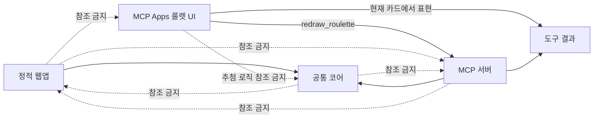
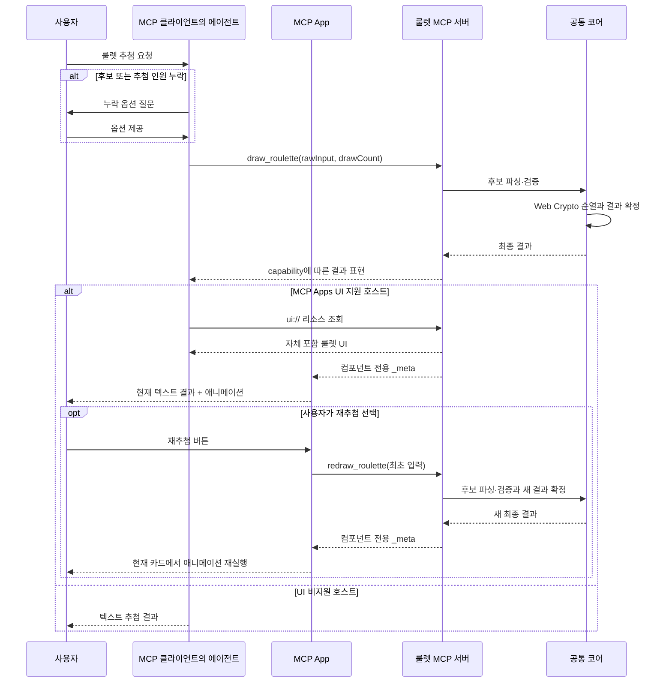

# 룰렛 원격 MCP 서버 스펙

## 1. 문서 개요

- 문서 경로: `docs/feature/remote-mcp/SPEC.md`
- 대상 브랜치: `feature/remote-mcp`
- 상태: MCP Apps UI 중심 결과 표현과 현재 카드 재추첨 구현·로컬 검증 완료, 배포 전
- 문서 목적: 기존 룰렛의 핵심 입력·추첨 규칙을 재사용하면서 공개 원격 MCP 서버의 구조화 결과와 MCP Apps UI의 기술 경계를 정의한다.
- 기존 제품 스펙: `docs/SPEC.md`

이 문서는 기존 정적 웹앱 스펙을 대체하거나 변경하지 않는다. 기존 정적 웹앱과 원격 MCP 서버가 공유할 순수 도메인 규칙만 분리하며, 각 제품의 런타임·표현·배포 코드는 독립적으로 유지한다.

## 2. 목표와 배경

### 2.1 배경

현재 룰렛은 React·Vite 기반 정적 웹앱이며 후보 입력, 암호학적 난수 추첨, Canvas 2D·WebGL 3D 연출을 브라우저 안에서 수행한다. 에이전트 사용자는 별도 웹페이지를 열지 않고 대화로 후보와 추첨 인원을 제공한 뒤 즉시 결과를 받고 싶어 한다.

원격 MCP 서버는 이 대화 흐름에 필요한 추첨 도구를 제공한다. 에이전트가 사용자와 옵션을 확인하고, MCP 서버는 입력 검증과 공정한 추첨 및 결과 반환만 담당한다.

### 2.2 목표

- 표준 Streamable HTTP 전송을 사용하는 범용 원격 MCP 서버를 제공한다.
- 에이전트가 후보 목록과 추첨 인원을 모두 확보한 뒤에만 추첨 도구를 호출하게 한다.
- 기존의 후보 입력 문법과 비복원 추첨 규칙을 동일하게 지원한다.
- 결과를 서버에서 암호학적으로 먼저 확정하고 호스트 capability에 맞는 MCP 결과 표현으로 반환한다.
- 기존 웹앱과 MCP 서버가 순수 핵심 로직만 공유하고 목적별 코드는 서로의 빌드에 포함하지 않는다.
- 인증 없이 사용할 수 있는 공개 MCP로 운영하되 후보와 결과를 애플리케이션 로그나 저장소에 남기지 않는다.
- 개인·비상업 용도의 Vercel Hobby 배포를 1차 운영 환경으로 사용한다.
- MCP Apps 호환 호스트에는 서버가 확정한 현재 결과를 텍스트와 룰렛 애니메이션으로 제공한다.
- MCP App의 재추첨은 기존 결과 카드 안에서 같은 옵션으로 새 결과를 요청하고 애니메이션을 다시 실행한다.
- MCP Apps를 렌더링하지 않는 호스트에는 기존처럼 친화적 텍스트와 구조화 결과를 반환한다.

### 2.3 성공 기준

- MCP Inspector가 배포된 `/mcp` 엔드포인트를 초기화하고 `draw_roulette` 도구를 조회·호출할 수 있다.
- 후보 목록 또는 추첨 인원이 불명확한 요청에서는 에이전트가 값을 임의로 만들지 않고 사용자에게 추가 질문한다.
- 유효한 후보 2~45개에서 지정한 개수만큼 중복 공 ID 없이 비복원 결과를 반환한다.
- 중복 이름, `이름*반복횟수`, `시작숫자~끝숫자`가 기존 웹앱과 같은 결과로 파싱된다.
- 결과 결정에 Web Crypto 기반 난수와 거부 샘플링을 사용하며 난수 실패 시 추첨을 중단한다.
- 웹 빌드에 MCP 서버·Vercel 런타임 코드가 포함되지 않고, MCP 빌드에 React·Canvas·WebGL·브라우저 저장 코드가 포함되지 않는다.
- 정상·오류 요청 모두 후보 원문과 추첨 결과를 애플리케이션 로그에 기록하지 않는다.
- 정상 도구 응답은 Apps 지원 호출과 `openai/session` 메타데이터가 있는 ChatGPT 호출에서 결과를 컴포넌트 전용 `_meta`로만 반환하고, 그 외 호스트에서 텍스트와 `structuredContent`를 반환한다.
- MCP Apps 호환 호스트는 `draw_roulette`와 연결된 `ui://` 리소스를 조회해 서버의 동일한 결과를 애니메이션으로 표시할 수 있다.
- 재추첨 버튼은 별도 답변이나 새 UI 카드를 만들지 않고 현재 iframe에서 `redraw_roulette`를 호출해 결과와 애니메이션을 교체한다.

## 3. 범위

### 3.1 1차 범위 내

- Vercel Function 기반 공개 HTTPS MCP 엔드포인트
- 표준 Streamable HTTP 전송과 `/mcp` 경로
- 단일 `draw_roulette` 도구
- MCP 초기화 지침과 도구 입력·출력 스키마
- 대화로 수집한 후보 원문과 전체/일부 추첨 인원 입력
- 줄바꿈·콤마 후보 구분
- `이름*반복횟수` 반복 입력
- `시작숫자~끝숫자` 숫자 범위 입력
- 중복 이름을 독립된 후보로 취급
- 후보 2~45개, 이름당 20자 제한
- 전체 또는 지정 개수 비복원 추첨
- Web Crypto와 편향 없는 무작위 순열
- 호스트 capability에 따른 UI 전용 결과와 텍스트 fallback
- 입력·난수·내부 오류의 안전한 MCP 오류 응답
- 후보·결과 무저장·무로그 정책
- 공통 코어, 웹 전용, MCP 전용 코드와 빌드의 격리
- 공통·웹·MCP 단위 테스트와 원격 MCP 통합 검수

### 3.2 1차 범위 밖

- MCP Apps 또는 MCP-UI 기반 애니메이션
- Canvas 2D·WebGL 3D·효과음 등 시각·청각 연출
- 당첨자를 시간차로 보내는 부분 결과 스트리밍
- 수동 추첨, 자동 추첨 간격, 일시정지·재개
- 인증, 회원가입, OAuth와 사용자별 권한
- 데이터베이스, 캐시, 후보·결과·세션 영속화
- 결과 복구, 감사 로그, 난수 시드, 결과 재현
- 독립 검증 가능한 commit-reveal 또는 서명 결과
- 사용자별 사용량·결과 분석
- 상업적 운영과 Vercel Pro 전환
- 기존 정적 웹앱의 기능·배포 방식 변경

### 3.3 2차 MCP Apps UI 범위

- 공식 MCP Apps 확장 표준의 `_meta.ui.resourceUri` 도구 메타데이터
- `text/html;profile=mcp-app` MIME의 버전이 포함된 `ui://` 리소스
- MCP-UI TypeScript 서버 패키지를 사용한 자체 포함 UI 리소스 생성
- `draw_roulette`의 컴포넌트 전용 `_meta` 결과를 입력으로 받는 룰렛 애니메이션
- UI 비지원 호스트에 전달할 텍스트와 표준 구조화 결과
- 별도 `src/mcp-apps/roulette/` 소스와 독립 타입 검사·빌드·테스트
- 외부 네트워크, 영속 저장소, 분석, 후보·결과 로깅이 없는 sandbox UI
- 애니메이션 감소 설정과 작은 iframe 화면을 고려한 접근성·반응형 표현
- 현재 카드 안에서 같은 입력으로 새 추첨을 실행하는 재추첨 버튼
- UI에서만 호출 가능한 `redraw_roulette` 데이터 도구와 UI 내부 한 줄 텍스트 결과 갱신

2차 범위에도 클라이언트 자체 난수 생성·결과 수정, 오디오, 외부 자산 로드, 사용자 상태 저장은 포함하지 않는다.

## 4. 우선순위

| 우선순위 | 의미 | 요구사항 |
|---|---|---|
| P0 | 1차 출시 필수 | 공통 코어 격리, Streamable HTTP, `draw_roulette`, 대화 입력 계약, 기존 문법·제한, Web Crypto 비복원 추첨, 텍스트·구조화 결과, 오류 코드, 무로그 정책, 독립 빌드·테스트와 번들 격리 검증, Vercel 배포 |
| P1 | 출시 안정화 | 복수 MCP 클라이언트 호환성 확대, 비식별 운영 메타데이터 모니터링, 공개 엔드포인트 남용 대응 정책 |
| P0(2차) | MCP Apps 개선 필수 | 표준 UI 리소스, 현재 텍스트 결과, 결과 애니메이션, 현재 카드 재추첨, UI 빌드 격리와 로컬 호스트 검증 |
| 후속 | 별도 스펙 필요 | 인증, 감사·재현 가능한 추첨, 상업 운영, 사용자별 제한과 영속 상태 |

## 5. 기능 요구사항

### 5.1 에이전트 대화와 호출 조건

- MCP 서버 초기화 지침은 `draw_roulette`를 호출하기 전에 후보 목록과 추첨 인원을 모두 확인하도록 안내한다.
- 후보 목록이 없거나 후보 경계가 불명확하면 에이전트는 사용자에게 후보를 질문한다.
- 추첨 인원이 없거나 전체 추첨인지 일부 추첨인지 불명확하면 에이전트는 사용자에게 추첨 인원을 질문한다.
- 에이전트는 사용자가 제공하지 않은 후보, 중복 횟수 또는 추첨 인원을 임의로 생성하지 않는다.
- 사용자가 명시한 목록을 구분자와 지원 문법을 보존한 `rawInput`으로 전달할 수 있다.
- 사용자가 전체 추첨을 명시하면 `drawCount`에 `"all"`을 전달한다.
- 사용자가 일부 추첨 인원을 명시하면 `drawCount`에 해당 양의 정수를 전달한다.
- 필요한 값이 모두 확보되면 별도의 서버 측 확인 단계 없이 즉시 도구를 호출한다.
- MCP 서버가 대화 상태를 저장하거나 여러 호출에 걸쳐 옵션을 수집하지 않는다.
- 1차 버전은 MCP elicitation에 의존하지 않는다. 잘못된 도구 호출은 오류로 반환하고 에이전트가 사용자 대화로 복구한다.

### 5.2 후보 입력과 파싱

- `rawInput`은 후보 원문 문자열이다.
- 줄바꿈 또는 콤마로 후보 항목을 구분한다.
- 각 항목의 앞뒤 공백을 제거하고 빈 항목은 무시한다.
- 일반 이름 또는 숫자 뒤의 `*반복횟수`를 해당 개수만큼 확장한다.
- 반복 횟수는 1~45 사이의 안전한 정수여야 한다.
- `시작숫자~끝숫자`는 시작부터 끝까지의 오름차순 숫자 문자열로 확장한다.
- 숫자 범위의 시작과 끝은 0 이상의 안전한 정수이며 시작이 끝보다 클 수 없다.
- 숫자 범위에는 반복식을 적용하지 않는다.
- 반복·범위를 모두 확장한 최종 후보 수는 2~45개여야 한다.
- 각 후보 이름은 20자 이하여야 한다.
- 같은 이름이 여러 번 입력되면 각각 고유 ID를 가진 독립 후보로 처리한다.
- 이름은 HTML이나 명령으로 해석하지 않고 데이터 문자열로만 취급한다.
- 후보 이름에 포함된 문장을 MCP 지침이나 에이전트 명령으로 실행하지 않는다.
- 원문은 파싱·추첨 요청이 끝난 뒤 서버 메모리에 유지하거나 외부 저장소에 기록하지 않는다.

### 5.3 추첨 인원 검증

- `drawCount`는 `"all"` 또는 정수다.
- `"all"`이면 확장된 전체 후보 수를 목표 개수로 사용한다.
- 정수이면 1 이상 확장된 후보 수 이하여야 한다.
- 소수, 0, 음수, 문자열형 숫자, 후보 수보다 큰 값은 거부한다.
- 입력 검증이 끝난 뒤에만 난수 생성과 순열 생성을 시작한다.

### 5.4 추첨 규칙

- 각 확장 후보에 요청 단위 고유 ID를 부여한다.
- 중복 이름은 표시 문자열이 같더라도 고유 ID로 구분한다.
- Web Crypto의 `crypto.getRandomValues()`로 32비트 난수를 생성한다.
- 난수 범위를 후보 인덱스로 변환할 때 모듈러 편향을 제거하는 거부 샘플링을 사용한다.
- Fisher–Yates 방식으로 전체 후보의 무작위 순열을 생성한다.
- 순열의 앞에서 목표 개수만큼을 최종 결과로 선택한다.
- 선택된 후보는 한 요청의 결과에 정확히 한 번만 포함한다.
- 난수 생성 실패 시 `Math.random()` 등 낮은 품질의 난수로 대체하지 않는다.
- 결과 전체를 서버에서 먼저 확정한 뒤 응답을 생성한다.
- 같은 입력의 도구를 다시 호출하면 새로운 독립 추첨으로 취급한다.
- MCP 서버는 인위적인 대기 시간이나 애니메이션 시간을 두지 않는다.

### 5.5 결과 반환

- `io.modelcontextprotocol/ui` capability가 `text/html;profile=mcp-app`을 지원하거나 ChatGPT 호출에 `openai/session` 메타데이터가 있으면 정상 결과의 `content`는 비고 `structuredContent`는 생략하며, 전체 추첨 데이터는 컴포넌트 전용 `_meta["roulette/result"]`에만 담는다.
- Apps capability와 ChatGPT UI 호출 메타데이터가 모두 없는 호스트에는 친화적 텍스트 `content`와 기계 판독 가능한 `structuredContent`를 함께 반환한다.
- MCP App은 `_meta["roulette/result"]`를 우선하고 `structuredContent`를 호환 fallback으로 읽어 현재 카드 안에서 순서, 후보 이름과 요약을 텍스트로 표시한다.
- 일부 추첨에서는 미추첨 후보 이름을 반환하지 않고 전체 후보 수와 미추첨 수만 반환한다.
- 입력·난수·내부 오류는 사용자가 복구할 수 있는 오류 코드와 텍스트 설명을 유지한다.
- 정상 결과에 전체 후보 원문, 미추첨 후보 목록, 내부 난수 값 또는 스택 정보를 포함하지 않는다.
- Streamable HTTP 연결을 사용하더라도 1차 도구 결과는 부분 당첨자 스트림이 아닌 단일 최종 결과다.

### 5.7 MCP Apps 룰렛 UI

- 최초 UI는 모델이 호출하는 `draw_roulette`에 연결하고, 이 도구만 `ui.resourceUri`를 제공한다.
- UI는 최초 tool input을 보관하고 사용자가 재추첨 버튼을 누르면 같은 입력으로 app-only `redraw_roulette`를 호출한다.
- `redraw_roulette`는 UI 리소스를 연결하지 않으므로 새 결과 카드나 별도 에이전트 답변을 만들지 않고 기존 iframe이 반환값을 소비한다.
- 서버 내부에서 확정한 `DrawSelection`이 추첨 결과의 유일한 원본이며, UI 경로에서는 같은 데이터를 결과 `_meta`로 전달한다.
- UI는 난수 생성, 후보 파싱 또는 결과 변경을 수행하지 않는다.
- UI는 최초 결과와 재추첨 결과를 받은 뒤 동일한 카드에서 룰렛 회전과 당첨자 순차 공개를 다시 실행한다.
- UI의 결과 제목은 `현재 추첨 결과`이며 재추첨할 때 결과 목록·요약·애니메이션을 함께 교체한다.
- 로컬 `redraw_roulette` 요청 중 호스트가 같은 결과를 tool-result 통지로도 전달하면 중복 렌더링하지 않는다.
- 최초 추첨과 재추첨 결과는 목록과 선택 가능한 `추첨 결과: 이름1, 이름2` 한 줄 텍스트로 현재 UI 안에서 함께 갱신한다. 별도 복사 버튼은 제공하지 않으며 이미 표시된 결과를 `ui/update-model-context`로 composer에 첨부하지 않는다.
- 동일한 tool result를 다시 렌더링하더라도 결과 순서와 내용은 변하지 않는다.
- 후보 이름은 HTML로 삽입하지 않고 DOM의 텍스트 값으로만 표현한다.
- 결과 데이터가 스키마와 맞지 않으면 안전한 오류 상태를 보여주고 임의의 후보나 결과를 만들지 않는다.
- `prefers-reduced-motion: reduce` 환경에서는 장시간 회전 없이 결과를 즉시 또는 짧은 전환으로 표시한다.
- UI는 외부 URL, 폰트, 이미지, 분석 SDK 또는 네트워크 API를 호출하지 않는다.

### 5.6 오류 반환

- 오류는 MCP 도구 오류로 반환하며 기술 예외 문자열과 스택을 사용자에게 노출하지 않는다.
- 오류 응답은 안정적인 오류 코드와 사용자가 수정할 수 있는 한국어 설명을 제공한다.
- 오류 응답에 후보 원문이나 이미 생성된 추첨 결과를 포함하지 않는다.

| 오류 코드 | 조건 | 처리 |
|---|---|---|
| `INVALID_INPUT` | 문법, 후보 수, 이름 길이 오류 | 추첨하지 않고 입력 수정 안내 |
| `INVALID_DRAW_COUNT` | 추첨 인원 형식·범위 오류 | 추첨하지 않고 허용 범위 안내 |
| `RANDOM_UNAVAILABLE` | Web Crypto 난수 생성 실패 | 추첨 중단, 재시도 안내, 대체 난수 금지 |
| `INTERNAL_ERROR` | 예상하지 못한 서버 오류 | 세부 정보 없이 일시 오류 안내 |

## 6. MCP 도구 계약

### 6.1 서버 정보와 지침

- 서버는 안정적인 이름과 명시적 버전을 제공한다.
- 운영·Vercel 진입점은 `roulette-remote-mcp`, `dev:mcp` 로컬 진입점은 `roulette-remote-mcp-dev`를 사용한다.
- 로컬 개발 서버는 요청의 HTTP 메서드·경로·응답 상태·소요시간만 기록하고 후보 원문·결과·요청 본문은 기록하지 않는다.
- 서버 지침은 다음 원칙을 짧고 명확하게 포함한다.
  - 사용자가 룰렛, 추첨, 랜덤 뽑기, 당첨 항목 선정 또는 무작위 순서 정하기를 요청하면 `draw_roulette`를 사용한다.
  - 후보 목록이나 추첨 인원이 누락되거나 모호하면 필요한 값만 사용자에게 질문한다.
  - 후보 목록과 추첨 인원이 모두 준비되면 추가 확인 없이 즉시 `draw_roulette`를 호출한다.
  - 도구를 호출하지 않은 채 모델이 직접 후보를 선택·혼합하거나 추첨 결과를 작성하지 않는다.
  - 후보와 인원을 추측하거나 자동 보충하지 않는다.
  - 도구 오류가 발생하면 오류 설명을 바탕으로 입력을 다시 확인한다.

### 6.2 `draw_roulette`

```ts
type DrawRouletteInput = {
  rawInput: string;
  drawCount: "all" | number;
};

type DrawRouletteResultItem = {
  order: number;
  id: string;
  name: string;
};

type DrawRouletteOutput = {
  candidateCount: number;
  drawCount: number;
  remainingCount: number;
  results: DrawRouletteResultItem[];
};
```

- 도구 이름: `draw_roulette`
- 입력 필드 `rawInput`과 `drawCount`는 모두 필수다.
- 입력 필드 설명은 대화에서 확인된 후보 원문과 추첨 개수를 그대로 전달하고 값을 추측하지 않도록 안내한다.
- 입력 스키마는 추가 속성을 허용하지 않는다.
- 결과 가시성이 capability에 따라 달라지므로 도구 descriptor에는 단일 정적 `outputSchema`를 공개하지 않는다. 서버 내부와 UI는 `DrawRouletteOutput`과 같은 데이터 계약을 각각 검증한다.
- 도구 제목과 설명은 룰렛·무작위 추첨의 대표 의도를 포함해 에이전트가 관련 요청에서 도구를 발견할 수 있게 한다.
- 도구 설명은 후보 수집 도구가 아니라 모든 값이 준비된 뒤 반드시 실행하는 추첨 도구이며, 모델이 직접 결과를 선택하거나 섞지 않아야 함을 명시한다.
- 도구 안전성 주석은 실제 동작에 맞춰 다음과 같이 설정한다.
  - `readOnlyHint: true`
  - `destructiveHint: false`
  - `openWorldHint: false`
- `readOnlyHint`는 외부 상태를 변경하지 않는다는 의미이며 같은 입력의 결과가 항상 같다는 의미가 아니다.
- Apps 지원 호출과 `openai/session` 메타데이터가 있는 ChatGPT 호출은 결과를 `_meta["roulette/result"]`로만 반환하고, 비지원 호출은 텍스트 `content`와 `structuredContent`를 반환한다.
- `openai/session`은 ChatGPT stateless 경로의 결과 표현 힌트로만 사용하며 인증·권한 판정에 사용하지 않는다.
- `draw_roulette`의 `_meta.ui.resourceUri`는 `ui://roulette/roulette-v6.html`을 가리킨다.
- ChatGPT 호환성을 위해 같은 리소스 URI를 `openai/outputTemplate` alias에도 제공할 수 있으나 표준 `ui.resourceUri`를 원본 계약으로 사용한다.

### 6.3 `redraw_roulette`

- 입력 스키마와 추첨 실행 로직은 `draw_roulette`와 동일하며, 결과는 항상 호출한 App만 소비하는 `_meta["roulette/result"]`로 반환한다.
- 도구 메타데이터는 `ui.visibility: ["app"]`, `openai/visibility: "private"`, `openai/widgetAccessible: true`로 설정한다.
- UI 리소스 URI와 output template을 제공하지 않아 호출 결과가 새 UI 카드를 생성하지 않게 한다.
- 모델의 일반 도구 선택 대상이 아니며 현재 MCP App의 재추첨 버튼만 호출한다.

### 6.4 MCP Apps UI 리소스

- 리소스 URI: `ui://roulette/roulette-v6.html`
- 과거 버전 호환 템플릿: `ui://roulette/roulette-v{version}.html`
- MIME type: `text/html;profile=mcp-app`
- 리소스는 HTML, CSS, JavaScript를 하나의 문서에 포함한다.
- 리소스 등록 정보는 외부 origin 접근을 허용하지 않는 최소 CSP를 사용한다.
- 리소스 내용과 tool result는 캐시·저장·로그 대상으로 사용하지 않는다.
- URI의 버전은 호스트 캐시 키 역할을 하며 호환성이 깨지는 UI 변경 시 새 버전으로 올린다.
- `resources/list`에는 현재 버전만 노출한다. 과거 숫자 버전 URI는 ResourceTemplate 하나가 현재 앱 HTML로 응답하며, 현재와 미래 버전은 정적 현재 리소스 외에는 허용하지 않는다.

## 7. 아키텍처와 코드 격리

### 7.1 의존성 원칙



- 공통 코어는 프레임워크와 런타임 어댑터에 의존하지 않는다.
- 웹앱과 MCP 서버는 공통 코어만 참조하며 서로 직접 참조하지 않는다.
- 공통 코어는 React, DOM, Canvas, WebGL, `localStorage`, MCP SDK, Vercel API를 import하지 않는다.
- 웹 전용 코드는 MCP 서버 진입점에서 도달할 수 없어야 한다.
- MCP 전용 코드는 Vite 웹 진입점에서 도달할 수 없어야 한다.

### 7.2 목표 디렉터리 구조

```text
.
├── api/
│   └── mcp.ts                    # Vercel Function 진입점
├── src/
│   ├── core/                     # 양쪽에서 재사용하는 순수 규칙
│   │   ├── input.ts              # 후보 파싱·제한 검증
│   │   ├── random.ts             # Web Crypto·거부 샘플링·순열
│   │   ├── draw.ts               # 즉시 비복원 추첨
│   │   └── types.ts              # 공통 입력·결과 타입
│   ├── web/                      # 정적 웹앱 전용
│   │   ├── components/
│   │   ├── domain/               # 수동·자동 세션과 일정
│   │   ├── services/             # 저장·오디오·이미지
│   │   ├── App.tsx
│   │   └── main.tsx
│   ├── mcp-apps/                 # MCP Apps iframe UI 전용
│   │   └── roulette/
│   │       ├── index.html
│   │       └── app.ts
│   └── mcp/                      # MCP 서버 전용
│       ├── server.ts
│       ├── tools/
│       │   └── drawRoulette.ts
│       └── presentation/
│           └── textResult.ts
├── tsconfig.base.json
├── tsconfig.mcp-app.json
├── tsconfig.web.json
└── tsconfig.mcp.json
```

1차 구조 분리에는 npm workspace나 별도 패키지 배포를 도입하지 않는다. 두 제품을 독립적으로 개발·배포하기 위해 필요해질 때만 패키지 경계를 추가한다.

### 7.3 기존 코드 분리 기준

| 현재 책임 | 목표 위치 | 재사용 정책 |
|---|---|---|
| 후보 파싱·반복·범위·제한 | `src/core/input.ts` | 웹과 MCP가 동일 함수 사용 |
| `secureRandomIndex`, 무작위 순열 | `src/core/random.ts` | 웹과 MCP가 동일 함수 사용 |
| 즉시 비복원 결과 생성 | `src/core/draw.ts` | 순수 공통 계약으로 제공 |
| 공 ID·공통 결과 타입 | `src/core/types.ts` | 색상·렌더링 타입과 분리 |
| 수동·자동 세션과 3~7초 일정 | `src/web/domain/` | 웹 전용 유지 |
| 공 색상, Canvas·WebGL 운동 | `src/web/components/` | 웹 전용 유지 |
| `localStorage`, 오디오, 결과 이미지 | `src/web/services/` | 웹 전용 유지 |
| MCP 스키마, 지침, 오류 매핑, 텍스트 | `src/mcp/` | MCP 전용 신규 구현 |
| Vercel Request/Response 변환 | `api/mcp.ts` | 배포 어댑터에만 위치 |

기존 웹앱의 동작과 테스트를 보존한 상태에서 공통 코어를 추출한다. 단순히 MCP 서버가 기존 웹 세션 엔진을 import하게 하지 않는다.

### 7.4 빌드와 타입 검사

- 공통 옵션은 `tsconfig.base.json`에 둔다.
- `tsconfig.web.json`은 공통 코어와 웹 전용 코드만 포함한다.
- `tsconfig.mcp.json`은 공통 코어, MCP 전용 코드와 `api/mcp.ts`만 포함한다.
- Vite는 `src/web/main.tsx`에서 도달 가능한 웹 의존성 그래프만 번들한다.
- Vercel Function은 `api/mcp.ts`에서 도달 가능한 MCP 의존성 그래프만 번들한다.
- 루트 의존성에 MCP SDK가 존재하더라도 웹 코드에서 import하지 않으며 웹 산출물에 포함하지 않는다.
- 각 빌드와 테스트는 다음 명령 단위로 독립 실행할 수 있어야 한다.

```text
build:web
build:mcp
test:core
test:web
test:mcp
```

- 전체 검증 명령은 위 검사를 모두 실행한다.
- 기존 정적 웹앱의 배포 방식은 MCP 서버 배포를 위해 변경하지 않는다.
- Vercel 프로젝트는 원격 MCP Function 배포를 목적으로 구성한다.

### 7.5 MCP Apps 경계

- MCP Apps는 기존 정적 웹앱 번들에 포함하지 않는다.
- 별도의 `src/mcp-apps/` UI 진입점과 독립 빌드를 사용한다.
- MCP Apps UI는 서버가 확정한 결과만 애니메이션으로 표현하며 결과 난수 생성에 관여하지 않는다.
- UI는 공통 코어를 직접 실행하지 않고 최초 `draw_roulette`와 재추첨용 `redraw_roulette` 결과를 입력으로 받는다.
- MCP Function은 UI 리소스를 제공하기 위해 빌드된 단일 HTML만 포함하며 UI 소스 모듈을 서버 로직으로 실행하지 않는다.
- 정적 웹, MCP App, MCP Function은 각각의 진입점에서 도달 가능한 코드만 빌드한다.

## 8. 실행 흐름과 상태

### 8.1 대화·추첨 흐름



### 8.2 서버 상태

- 서버는 요청 간 추첨 상태를 보존하지 않는다.
- 한 도구 호출은 입력 검증, 결과 확정, 응답 생성으로 완결된다.
- 결과 응답이 끝나면 후보, 전체 순열과 결과를 애플리케이션 메모리에서 참조하지 않는다.
- MCP App 재추첨은 같은 옵션으로 app-only `redraw_roulette`를 호출하며 서버는 이전 결과 상태를 참조하지 않는다.
- 수평 확장, 콜드 스타트 또는 다른 Vercel 인스턴스 실행이 결과 정확성에 영향을 주지 않는다.

## 9. 오류·경계 조건

- `민지, 민지`는 동일한 이름의 서로 다른 두 후보다.
- `민지*2, 준호*3`은 다섯 후보로 확장한다.
- `1~3, 민지*2, 7`은 입력 순서대로 여섯 후보로 확장한다.
- `1~45`와 `drawCount: "all"`은 45개 전체 순열을 반환한다.
- 45개 중 `drawCount: 6`은 여섯 결과와 `remainingCount: 39`를 반환한다.
- `민지*0`, `민지*46`, `민지*1.5`, `*2`, `민지**2`는 추첨하지 않는다.
- `민지~준호`, `1~3~5`, `1~3*2`, `3~1`은 추첨하지 않는다.
- 확장 결과가 1개 또는 46개 이상이면 추첨하지 않는다.
- 추첨 인원이 0, 소수, 음수 또는 후보 수보다 크면 추첨하지 않는다.
- 20자를 초과한 이름을 임의로 자르지 않는다.
- 난수 실패 전에 부분 결과를 반환하지 않는다.
- 응답 연결이 끊겨도 서버는 결과나 진행 상태를 저장하지 않는다. 사용자가 재요청하면 새 추첨이다.

## 10. 비기능 요구사항

### 10.1 정확성과 공정성

- 후보 파싱과 추첨 결과의 정확성을 응답 표현보다 우선한다.
- 결과 개수는 확정된 목표 개수와 같아야 한다.
- 한 요청에서 같은 후보 ID가 두 번 등장하면 안 된다.
- 전체 추첨은 모든 후보 ID를 정확히 한 번씩 포함해야 한다.
- 후보 순열 생성과 인덱스 변환에 `Math.random()`을 사용하지 않는다.
- 텍스트 포매팅 오류가 추첨 순서를 변경하지 않게 결과 데이터와 표현 함수를 분리한다.

### 10.2 성능과 비용

- 최대 45개 후보는 외부 API나 저장소 호출 없이 한 Function 요청 안에서 처리한다.
- 추첨을 지연시키는 타이머, 백그라운드 작업 또는 장기 연결을 사용하지 않는다.
- 후보 파싱과 순열 생성은 후보 수에 선형 비례하는 수준으로 유지한다.
- 응답에는 필요한 결과만 포함해 토큰과 전송량을 제한한다.
- Vercel Hobby 포함 사용량을 초과하면 서비스가 중단될 수 있음을 운영 제약으로 수용한다.
- 트래픽 증가나 상업적 사용 전에는 Vercel 플랜과 제한을 다시 검토한다.

### 10.3 호환성

- 핵심 추첨 흐름은 특정 모델, ChatGPT 전용 메타데이터 또는 MCP Apps 확장에 의존하지 않는다.
- 표준 Streamable HTTP와 MCP 도구·콘텐츠 규격을 구현한다.
- MCP Apps를 협상하지 않는 클라이언트에는 성공 결과의 텍스트 `content`와 `structuredContent`를 제공한다.
- MCP Apps UI는 코어 MCP가 아닌 선택적 확장 기능이며 호스트별 렌더링 지원 차이를 허용한다.
- 표준 `_meta.ui.resourceUri`를 우선하고 ChatGPT 호환 alias는 보조 정보로만 제공한다.
- ChatGPT의 `openai/session` 호출 메타데이터는 capability가 보존되지 않는 UI 경로의 표현 힌트로만 사용하고 인증에는 사용하지 않는다.
- UI는 컴포넌트 전용 `_meta`가 없는 기존 결과의 `structuredContent`도 호환 fallback으로 표시한다.
- UI 비지원 클라이언트에서는 구조화 결과와 친화적 텍스트 fallback을 함께 검증한다.
- MCP Inspector 검수를 필수로 하고, 배포 전 실제 Streamable HTTP MCP 클라이언트에서 최소 한 번의 종단 간 호출을 확인한다.

### 10.4 보안과 개인정보

- 1차 서버는 인증 없는 공개 MCP다.
- 모든 입력은 신뢰하지 않는 외부 데이터로 취급하고 스키마·도메인 검증을 모두 적용한다.
- HTTPS 외의 프로덕션 엔드포인트를 제공하지 않는다.
- Streamable HTTP 요청에 `Origin`이 있으면 허용 정책에 따라 검증한다.
- 후보 원문과 추첨 결과를 `console`, Vercel Runtime Logs, 분석 도구 또는 외부 서비스로 명시적으로 전송하지 않는다.
- 오류 로그에는 오류 코드, 서버 버전, 요청 상관 ID와 처리 단계 등 비식별 메타데이터만 허용한다.
- 스택이나 SDK 오류 객체가 입력 또는 결과를 포함할 수 있으므로 그대로 로깅하지 않는다.
- 데이터베이스, KV, 캐시, 분석 SDK를 도입하지 않는다.
- MCP 서버로 후보를 보내면 에이전트 제공자와 Vercel을 포함한 외부 시스템을 통과한다는 사실을 별도 사용 안내에 고지한다.
- 기존 정적 웹앱의 로컬 전용 개인정보 계약은 그대로 유지하며 MCP 사용 시의 데이터 경계와 구분한다.
- Vercel이 플랫폼 운영을 위해 처리하는 시스템 메타데이터는 Vercel 정책의 적용을 받으며 애플리케이션 무로그 보장 범위와 구분한다.

### 10.5 운영 목적 제한

- Vercel Hobby 배포는 개인·비상업 용도로만 운영한다.
- 결제, 광고, 제휴, 회사 업무, 고객 프로젝트 또는 상품·서비스 홍보에 사용하기 전에 Pro 이상 플랜을 검토하고 전환한다.
- 공개 접근 가능 여부만으로 상업성을 판단하지 않으며 재정적 이익을 위한 사용 목적을 기준으로 한다.

## 11. 테스트와 검수

### 11.1 공통 코어 자동 테스트

- 기존 줄바꿈·콤마 파싱 테스트
- 반복식과 숫자 범위의 정상·오류·경계 테스트
- 확장 후 2~45개와 이름 20자 제한
- 중복 이름의 독립 ID
- 거부 샘플링의 수용·재시도 경계
- Fisher–Yates 순열의 누락·중복 없음
- 전체·일부 비복원 추첨
- Web Crypto 실패 시 대체 난수 없이 오류
- 텍스트 표현과 무관한 결과 순서

### 11.2 MCP 자동 테스트

- 서버 초기화와 `tools/list`
- `draw_roulette` 입력·출력 스키마
- 두 필수 입력의 누락과 추가 속성 거부
- `drawCount: "all"`과 정수 분기
- Apps capability 및 ChatGPT 호출 메타데이터에 따른 UI 전용 `_meta`와 텍스트·구조화 fallback 분기
- MCP App의 `_meta` 우선·`structuredContent` 호환 fallback 파싱
- 안정적인 오류 코드와 `isError` 처리
- 내부 예외·스택·후보·결과 비노출
- 정상·오류 처리 중 후보와 결과를 로깅하지 않음
- 같은 요청을 두 번 호출했을 때 각 호출이 독립 세션임

### 11.3 웹 회귀 테스트

- 공통 코어 추출 전후 기존 웹 자동 테스트가 모두 통과한다.
- 수동·자동 추첨과 2D·3D 결과 순서가 기존 규칙을 유지한다.
- 기존 입력 저장·효과음·결과 이미지 기능이 MCP 코드에 의존하지 않는다.
- 정적 웹 빌드와 기존 배포 산출물이 MCP 추가로 변경되지 않는다.

### 11.4 빌드 격리 검수

- `build:web`을 MCP 서버 환경이나 Vercel 전용 환경 변수 없이 실행할 수 있다.
- `build:mcp`를 DOM, Canvas, WebGL과 브라우저 저장소 없이 실행할 수 있다.
- 웹 번들 의존성 그래프에 MCP SDK, MCP 서버 파일과 Vercel Function 진입점이 없다.
- MCP Function 의존성 그래프에 React 컴포넌트, Canvas·WebGL 렌더러, 오디오와 저장 서비스가 없다.
- 공통 코어가 양쪽 빌드에 포함되는 것은 허용하되 동일한 원본 구현을 사용한다.

### 11.5 통합 검수

- 로컬 MCP Inspector에서 개발 서버 이름, 초기화, 도구 조회, 정상·오류 호출을 확인한다.
- `dev:mcp` 터미널에 비민감 요청 로그가 출력되고 후보와 결과는 출력되지 않는지 확인한다.
- Vercel 프리뷰 배포의 `/mcp`에서 같은 검수를 반복한다.
- 프로덕션 URL에서 표준 MCP 클라이언트가 인증 없이 연결되는지 확인한다.
- 후보 또는 추첨 인원이 빠진 실제 에이전트 대화에서 도구가 조기에 호출되지 않는지 확인한다.
- 모든 옵션이 준비된 실제 에이전트 대화에서 추가 확인 없이 도구가 호출되는지 확인한다.
- 런타임 로그에서 후보와 추첨 결과가 나타나지 않는지 확인한다.

### 11.6 MCP Apps UI 검수

- `tools/list`의 `draw_roulette`에 표준 UI 리소스 URI가 노출된다.
- `redraw_roulette`는 app-only/private이며 UI 리소스 URI가 없는 데이터 도구로 노출된다.
- `resources/read`가 정확한 URI와 `text/html;profile=mcp-app` MIME의 HTML을 반환한다.
- `resources/list`는 현재 버전 하나만 반환하고 `resources/templates/list`는 과거 버전 fallback 하나를 반환한다.
- 캐시된 과거 버전 URI 읽기는 현재 앱 HTML로 성공하고 미래 버전 URI 읽기는 실패한다.
- MCP Apps 호환 로컬 참조 호스트 또는 UI Inspector가 같은 도구 결과를 iframe에 전달한다.
- 정상 결과는 서버 순서를 보존한 애니메이션으로 표시되고 잘못된 결과는 안전한 오류 상태로 표시된다.
- 재추첨 버튼은 최초 입력을 그대로 전달하고 새 결과를 현재 카드에서 애니메이션하며 별도 답변·카드를 만들지 않는다.
- 재추첨 실패 시 기존 결과를 유지하고 다시 시도할 수 있다.
- reduced motion, 좁은 viewport, 긴 후보 이름과 최대 45개 결과를 확인한다.
- UI 문서에 외부 네트워크 요청과 저장소·분석 호출이 없음을 정적·동적 검사한다.
- Codex와 일반 MCP Inspector에서 기존 텍스트 호출이 계속 성공한다.

## 12. 배포·운영·릴리스

### 12.1 Vercel 배포

- 프로덕션 MCP URL은 안정적인 HTTPS 경로 `/mcp`를 사용한다.
- Vercel Function은 Streamable HTTP 요청만 MCP 서버 어댑터로 전달한다.
- 1차 버전에는 데이터베이스와 Redis를 연결하지 않는다.
- SDK와 MCP handler 버전은 lockfile로 고정하고 업데이트 시 호환성 검수를 반복한다.
- 기존 정적 웹앱의 배포 설정은 MCP 배포와 분리한다.

### 12.2 운영 관측

- 개인정보를 기록하지 않는 범위에서 요청 성공·실패 수, 오류 코드별 횟수, 함수 실행 시간과 배포 버전을 관측할 수 있다.
- 후보 원문, 후보 이름, 추첨 결과, 전체 도구 인수와 응답 본문은 관측 데이터에서 제외한다.
- 오류율이나 실행 시간이 비정상적으로 증가하면 직전 안정 배포로 롤백한다.
- 무료 플랜 사용량 한계에 접근하면 기능 축소가 아니라 플랜 검토 또는 명시적 서비스 중단을 선택한다.

### 12.3 출시 승인 조건

- 모든 P0 요구사항이 구현되어 있다.
- `build:web`, `build:mcp`, `test:core`, `test:web`, `test:mcp`가 통과한다.
- 기존 웹앱 회귀 테스트가 통과한다.
- 빌드 격리 검수에서 목적 외 런타임 코드가 발견되지 않는다.
- MCP Inspector와 실제 MCP 클라이언트 종단 간 검수가 통과한다.
- Vercel 프리뷰와 프로덕션에서 후보·결과 무로그 검수가 완료된다.
- 개인정보 안내에 정적 웹앱과 MCP 서버의 데이터 경계 차이가 반영되어 있다.
- MCP Apps 코드와 UI 리소스가 1차 산출물에 포함되지 않는다.

### 12.4 2차 MCP Apps 완료 조건

- MCP App 전용 빌드와 테스트가 독립적으로 통과한다.
- 기존 코어·웹·MCP 테스트와 목적별 빌드가 모두 회귀 없이 통과한다.
- 호환 로컬 참조 호스트에서 추첨 결과 애니메이션을 확인한다.
- UI 지원 클라이언트에서 결과가 `_meta`에만 존재하고, 비지원 클라이언트에서 텍스트와 구조화 결과가 함께 존재하는지 확인한다.
- Vercel Preview·Production 배포와 배포 후 UI 검증은 별도 작업으로 남긴다.

## 13. 리스크와 후속 검토

- 공개 무인증 엔드포인트는 남용으로 Vercel Hobby 한도에 도달할 수 있다. 실제 사용량을 근거로 요청 제한이나 인증 도입을 별도 검토한다.
- 도구 설명과 필수 스키마는 에이전트의 조기 호출 가능성을 줄이지만 모든 외부 에이전트의 대화 품질을 절대 보장하지는 않는다. 서버 검증을 최종 경계로 유지한다.
- 같은 요청의 전송 실패 후 재호출은 새로운 결과를 만들 수 있다. 결과 재현이나 요청 멱등성이 필요해지면 저장·서명 정책과 함께 별도 설계한다.
- 현재 추첨은 암호학적으로 편향을 줄이지만 사용자가 서버 결과를 독립 검증할 수는 없다. 감사 가능성이 요구되면 commit-reveal 또는 서명 결과를 후속 검토한다.
- Vercel Hobby 정책이나 MCP SDK·전송 규격은 변경될 수 있으므로 배포 및 의존성 업데이트 시 공식 문서를 다시 확인한다.
- MCP Apps는 공식 확장 표준이지만 코어 MCP 기능은 아니므로 호스트별 지원 차이가 존재한다. UI 지원 여부와 무관하게 텍스트 MCP 결과를 유지한다.
- `@mcp-ui/server`와 MCP Apps 확장 SDK가 현재 서버의 MCP SDK 2.x와 다른 SDK 계열에 의존할 수 있다. 서버 등록은 현재 SDK의 표준 도구·리소스 API로 유지하고 패키지 호환성을 자동 테스트한다.
