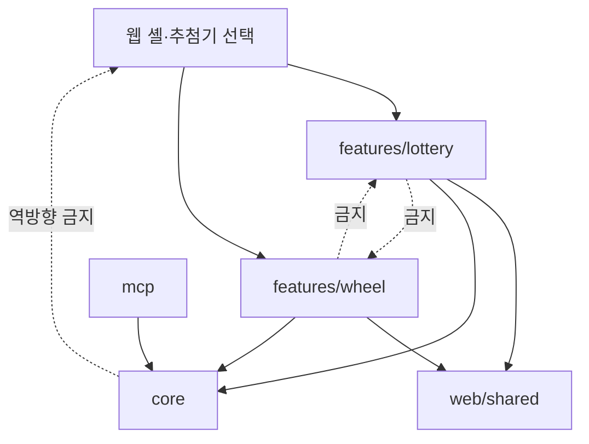

# 돌림판 추첨기 추가 설계

## 1. 문서 개요

- 문서 경로: `docs/feature/wheel-draw/DESIGN.md`
- 대상 브랜치: `feature/wheel-draw`
- 핵심 목표: 기존 로또 추첨기와 독립적으로 발전할 수 있는 돌림판 추첨기를 정적 웹앱에 추가한다.
- 주요 작업: 웹 코드를 추첨기별 수직 기능 단위로 격리하고, 복원 추첨을 지원하는 돌림판 도메인과 UI를 별도로 구현한다.
- 기존 기준: `docs/SPEC.md`, `docs/architecture.md`

이 문서는 구현 작업의 구조적 기준을 정의한다. 기존 `docs/SPEC.md`의 로또 전용 비복원 추첨 요구사항은 로또 기능에만 유지하며, 돌림판 기능에 자동으로 적용하지 않는다.

## 2. 배경과 문제

현재 웹앱은 로또 추첨기 하나를 전제로 구성되어 있다. 공통 코어는 후보와 난수 추첨을 표현 계층에서 분리하지만, 웹 세션과 UI에는 다음과 같은 로또 전용 개념이 포함되어 있다.

- `Ball`, `ballId`, `remainingBallIds` 중심의 세션 모델
- 당첨 후보를 남은 후보에서 제거하는 비복원 상태 전이
- 모든 결과가 서로 다른 후보 ID를 가진다는 결과 목록 계약
- 로또 혼합과 배출 시간을 조정하는 `App`의 타이머·음향 수명주기
- 로또 추첨기에만 적용되는 2D·3D 렌더링 설정

돌림판은 같은 후보가 여러 번 당첨될 수 있는 복원 추첨을 기본 모델로 삼을 수 있다. 이 경우 남은 후보, 후보 소진, 후보 ID 기반 결과 식별과 같은 로또 전용 계약이 맞지 않는다. 로또와 돌림판을 하나의 범용 세션 엔진으로 묶으면 추첨기별 차이를 표현하기 위한 정책 플래그와 capability가 계속 늘어나게 된다.

## 3. 목표와 비목표

### 3.1 목표

- 웹 시작 화면에서 로또 추첨기와 돌림판 추첨기를 선택할 수 있게 한다.
- 로또와 돌림판의 도메인, 상태 전이, 설정, UI, 저장소와 테스트를 서로 격리한다.
- 후보와 안전한 난수 같은 안정적인 핵심 프리미티브만 공유한다.
- 돌림판 결과는 같은 후보가 반복 당첨될 수 있으며 각 당첨 사건을 별도 ID로 식별한다.
- 애니메이션이 추첨 결과를 결정하거나 변경하지 않게 한다.
- 기존 로또 추첨기의 동작, 저장값과 MCP 빌드 경계를 보존한다.
- 향후 새로운 추첨기를 추가할 때 기존 추첨기 코드를 수정하는 범위를 최소화한다.

### 3.2 비목표

- 모든 추첨기를 포괄하는 범용 `DrawSession` 또는 추첨기 플러그인 프레임워크
- 로또와 돌림판의 설정·결과 UI를 강제로 동일하게 만드는 것
- 웹의 추첨기 선택을 Remote MCP 도구 계약으로 확장하는 것
- 로또와 돌림판을 즉시 별도 배포하거나 별도 Vite 프로젝트로 만드는 것
- 서버 상태, 계정, 결과 동기화 또는 감사 로그 추가
- 이번 구조 변경과 무관한 기존 로또 렌더러 내부 재작성

## 4. 검토한 대안

### 4.1 대안 A: 공통 세션 엔진과 형식별 렌더러

하나의 세션 엔진이 후보, 진행 상태, 결과, 타이머를 관리하고 로또와 돌림판은 렌더러만 교체한다.

장점:

- 세션과 제어 UI의 코드 재사용률이 높다.
- 추첨 규칙과 진행 방식이 같은 시각화 변형을 추가하기 쉽다.
- 공통 흐름의 테스트를 한 번만 작성할 수 있다.

단점:

- 복원·비복원, 후보 제거, 완료 조건, 결과 식별 방식이 다른 경우 공통 모델이 불안정해진다.
- `replacementPolicy`, `supportsRemainingCandidates`, `completionPolicy` 같은 분기 옵션이 누적된다.
- 추첨기 하나의 요구사항이 공통 엔진과 다른 추첨기의 회귀 위험으로 전파된다.
- 공통 계약에 맞추기 위해 각 추첨기의 자연스러운 상태 모델을 왜곡할 수 있다.

이 방식은 같은 로또 추첨기의 2D·3D 렌더링처럼 결과 규칙과 상태가 동일한 표현 변형에만 사용한다.

### 4.2 대안 B: 핵심 프리미티브만 공유하고 추첨기별 수직 격리

각 추첨기가 자체 도메인, 컴포넌트, 서비스와 테스트를 소유하고, 하위의 안정적인 핵심 프리미티브만 공유한다.

장점:

- 추첨기별 요구사항을 조건문이나 capability 없이 직접 모델링할 수 있다.
- 한 추첨기의 변경이 다른 추첨기에 미치는 영향이 작다.
- 기능 단위의 별도 번들·빌드·배포가 필요해질 때 분리하기 쉽다.
- 과도한 범용화보다 일부 명시적인 중복을 선택할 수 있다.

단점:

- 설정, 결과 표시와 수명주기 코드 일부가 중복될 수 있다.
- 공통 UI와 기능 전용 UI의 경계를 지속적으로 관리해야 한다.
- 추첨기별 테스트와 저장소 마이그레이션을 각각 유지해야 한다.

### 4.3 결정

대안 B를 채택한다.

추첨기 사이의 공통 추상화는 두 개 이상의 실제 구현에서 동일한 책임과 변경 이유가 확인된 뒤에만 도입한다. 미래의 재사용 가능성만으로 세션 인터페이스, 전략 클래스 또는 capability 집합을 추가하지 않는다.

## 5. 목표 아키텍처



의존성 규칙은 다음과 같다.

- 웹 셸은 추첨기 목록과 선택 상태만 알고 각 기능의 내부 세션을 알지 않는다.
- `features/lottery`와 `features/wheel`은 서로 import하지 않는다.
- 두 기능은 `core`와 검증된 `web/shared` 모듈만 참조할 수 있다.
- `core`와 `web/shared`는 특정 추첨기 기능을 참조하지 않는다.
- MCP는 기존처럼 `core`만 참조하며 웹 셸과 웹 기능을 참조하지 않는다.
- 새 추첨기는 독립적인 `features/<type>` 디렉터리와 셸 등록만으로 추가할 수 있어야 한다.

## 6. 목표 디렉터리 구조

```text
src/
├── core/
│   ├── types.ts                    # Candidate 등 표현 독립 데이터
│   ├── input.ts                    # 공통 후보 문법 파싱
│   ├── random.ts                   # Web Crypto 난수 프리미티브
│   └── draw.ts                     # 선택적으로 사용하는 비복원 즉시 추첨
├── web/
│   ├── App.tsx                     # 추첨기 선택과 공통 셸 조정
│   ├── shared/
│   │   ├── components/             # 실제로 공통인 작은 UI
│   │   └── services/               # 표현 독립 브라우저 유틸리티
│   └── features/
│       ├── lottery/
│       │   ├── domain/             # 비복원 세션·자동 일정
│       │   ├── components/         # 로또 설정·추첨기·결과
│       │   ├── services/           # 로또 옵션·음향·결과 이미지
│       │   └── index.ts
│       └── wheel/
│           ├── domain/             # 복원 세션·회전 결과·각도 계산
│           ├── components/         # 돌림판 설정·회전판·결과 이력
│           ├── services/           # 돌림판 옵션·음향·저장
│           └── index.ts
├── mcp-apps/
└── mcp/
```

실제 이동 과정에서는 동작 변경과 파일 이동을 분리한다. 기존 `LotteryMachine`의 큰 렌더링 구현은 기능 디렉터리로 이동하되, 돌림판 추가를 이유로 내부 구현까지 일반화하지 않는다.

## 7. 공유 경계

### 7.1 공유할 수 있는 핵심

| 모듈 | 공유 이유 | 제약 |
|---|---|---|
| `Candidate` | 모든 추첨기가 후보 ID와 표시 이름을 사용 | 세션·잔여 상태를 포함하지 않음 |
| `secureRandomIndex` | 한 후보를 편향 없이 선택하는 난수 프리미티브 | 복원·비복원 정책을 결정하지 않음 |
| `createDrawOrder` | 로또와 MCP가 사용하는 비복원 순열 | 돌림판이 필요할 때만 명시적으로 선택 |
| 후보 입력 문법 | 콤마·줄바꿈·반복·숫자 범위 해석 | 후보 수와 이름 길이 정책은 제품별 분리 가능 |
| 작은 브라우저 유틸리티 | 저장소 접근 실패 처리 등 동작이 동일 | 기능 설정 스키마는 소유하지 않음 |

`core/draw.ts`의 비복원 추첨은 보편적인 추첨 엔진이 아니라 로또와 MCP가 선택적으로 사용하는 알고리즘으로 취급한다. 돌림판은 이를 사용하지 않고 `secureRandomIndex`로 매 회전 독립 선택한다.

### 7.2 공유하지 않을 항목

- 공통 `DrawSession`, `DrawPhase`, `DrawResult`
- 남은 후보와 완료 조건
- 수동·자동 모드 상태 전이
- 연출 시작·완료 타이머
- 재추첨과 초기화 의미
- 추첨기별 설정과 저장 스키마
- 결과 목록·결과 이력 컴포넌트
- 효과음 수명주기
- 2D·3D·SVG·Canvas 렌더링 방식

`ToastStack`, 공통 버튼과 같은 UI도 이름이 비슷하다는 이유만으로 이동하지 않는다. 두 기능에서 같은 계약으로 실제 사용되는 것이 확인된 후 `web/shared`로 승격한다.

## 8. 웹 셸과 기능 진입점

웹 셸은 다음 책임만 가진다.

- 사용할 추첨기 종류 선택
- 선택한 추첨기 기능 마운트
- 사이트 공통 헤더·푸터와 최상위 오류 경계
- 마지막으로 선택한 추첨기 종류 저장

셸은 추첨기의 후보, 진행 단계, 결과와 내부 설정을 읽거나 변경하지 않는다. 초기 구현은 명시적인 `switch` 또는 작은 정적 레지스트리로 충분하다.

```ts
type DrawExperienceType = "lottery" | "wheel";

type DrawExperienceMetadata = {
  type: DrawExperienceType;
  label: string;
  description: string;
};
```

레지스트리에는 표시용 메타데이터만 둔다. 세션 생성기, 추첨 전략과 capability를 넣어 범용 플러그인 계약으로 확장하지 않는다.

## 9. 기존 로또 기능 격리

구조 변경 단계에서 기존 로또 기능의 동작을 변경하지 않는다.

- 현재 비복원 세션과 `remainingBallIds` 의미를 로또 기능 내부에 유지한다.
- 현재 수동·자동 추첨, 3~7초 일정과 백그라운드 복구를 유지한다.
- 현재 2D·3D 실시간 전환과 WebGL fallback을 유지한다.
- 현재 `localStorage` 키를 유지해 기존 입력과 설정을 그대로 복원한다.
- 현재 효과음, 결과 복사와 이미지 저장을 유지한다.
- 기존 웹 테스트를 기능 이동 전후의 회귀 기준으로 사용한다.

로또 내부에서는 `Ball` 용어를 계속 사용할 수 있다. 다른 추첨기와 공유하기 위한 목적으로 모든 내부 이름을 `Candidate`로 기계적으로 바꾸지 않는다.

## 10. 돌림판 도메인 설계

### 10.1 기본 추첨 규칙

- 각 회전은 현재 전체 후보를 대상으로 독립적으로 수행한다.
- 당첨 후보는 다음 회전에서도 제거하지 않는다.
- 같은 후보가 여러 번 당첨될 수 있다.
- 후보 ID는 후보를 식별하고, 결과 ID는 개별 당첨 사건을 식별한다.
- 결과는 회전 시작 시 안전한 난수로 먼저 확정한다.
- 돌림판 애니메이션은 확정된 후보에서 목표 각도만 계산한다.
- 난수 생성에 실패하면 회전을 시작하지 않고 오류 상태로 전환한다.
- `Math.random()`을 결과 결정의 대체 난수로 사용하지 않는다.

### 10.2 개념 모델

```ts
type WheelCandidate = {
  id: string;
  name: string;
};

type WheelOutcome = {
  id: string;
  spinNumber: number;
  candidateId: string;
  name: string;
  drawnAt: number;
};

type ActiveSpin = {
  outcomeId: string;
  targetCandidateId: string;
  startedAt: number;
  revealAt: number;
};

type WheelSession = {
  candidates: WheelCandidate[];
  phase: "ready" | "spinning" | "error";
  activeSpin: ActiveSpin | null;
  outcomes: WheelOutcome[];
  error: string | null;
};
```

구체적인 필드명은 구현 중 조정할 수 있지만 다음 불변식은 유지한다.

- `WheelOutcome.id`는 반복 당첨 여부와 무관하게 항상 고유하다.
- `candidateId`는 여러 결과에서 반복될 수 있다.
- 활성 회전의 목표 후보는 결과 공개 전에도 렌더러가 읽을 수 있다.
- 렌더러가 목표 후보를 다시 선택하거나 세션 결과를 직접 추가하지 않는다.
- 회전 완료는 세션 전이가 처리하며 프레임 드롭과 무관하게 동일한 결과를 반영한다.

### 10.3 돌림판 각도 계산

`wheelGeometry`는 DOM이나 React에 의존하지 않는 순수 계산 모듈로 둔다.

- 후보 순서와 후보 ID로 목표 구획의 중심 각도를 계산한다.
- 현재 회전 각도에서 최소 회전 수를 더해 최종 정지 각도를 만든다.
- 포인터 위치와 CSS/SVG 좌표계의 차이를 한 곳에서 보정한다.
- 후보가 2개와 45개인 경계를 처리한다.
- 중복 이름이 아니라 후보 ID와 인덱스로 구획을 구분한다.

회전 수나 easing은 연출 설정이며 당첨 결과에 영향을 주지 않는다. 테스트는 최종 정규화 각도가 목표 구획 안에 들어가는지를 검증한다.

## 11. 돌림판 UI 구조

돌림판 기능은 자체 설정, 실행 화면과 결과 이력을 가진다.

- `WheelApp`: 돌림판 기능의 상태와 수명주기 조정
- `WheelSetup`: 후보와 돌림판 전용 옵션 입력
- `WheelStage`: 구획, 포인터와 회전 애니메이션 표시
- `WheelControls`: 회전, 재회전과 설정 복귀 제어
- `WheelResultHistory`: 반복 당첨을 허용하는 회전별 결과 목록

돌림판 렌더링은 우선 SVG와 단일 회전 transform을 권장한다. 구획과 레이블을 구조적으로 표현하고 목표 각도 계산을 분리하기 쉽기 때문이다. 실제 렌더링 기술은 돌림판 기능 내부 결정이며 로또 렌더러나 공통 셸에 노출하지 않는다.

## 12. 저장소 설계

저장소는 셸과 추첨기별로 분리한다.

```text
roulette:selected-experience:v1     # 셸의 마지막 추첨기 선택
lottery-draw:names:v1               # 기존 로또 입력, 유지
lottery-draw:setup-options:v1       # 기존 로또 옵션, 유지
wheel-draw:candidates:v1            # 돌림판 후보 입력
wheel-draw:setup-options:v1          # 돌림판 옵션
```

- 셸의 선택값이 손상되었거나 없으면 기존 사용자 호환을 위해 로또를 기본값으로 사용한다.
- 로또 저장값은 돌림판 설정과 합치거나 새 공통 스키마로 마이그레이션하지 않는다.
- 돌림판 진행 결과는 별도 요구사항이 없으면 새로고침 후 복원하지 않는다.
- 한 추첨기의 저장 오류가 다른 추첨기의 설정을 초기화하지 않게 한다.

## 13. 빌드와 경계

초기에는 기존 `build:web`을 유지한다. 로또와 돌림판은 같은 React·브라우저 런타임을 사용하므로 논리적 분리만으로 충분하다.

- 추첨기 기능은 별도 디렉터리와 import 경계로 격리한다.
- 번들 크기가 커지면 셸에서 기능을 동적 import하여 청크를 분리한다.
- 경계 검증 스크립트에 로또·돌림판 간 교차 import 금지를 추가한다.
- 웹 타입 검사와 테스트는 두 기능을 모두 포함한다.
- MCP App과 MCP 서버의 기존 독립 빌드 설정은 변경하지 않는다.

다음 조건이 실제로 생길 때 별도 Vite 진입점이나 빌드를 검토한다.

- 기능별 독립 URL과 배포 주기가 필요함
- 한 기능의 대형 의존성을 다른 기능 번들에서 완전히 배제해야 함
- 서로 다른 브라우저 지원 범위나 보안 정책이 필요함
- 기능별 독립 제품으로 운영해야 함

## 14. 구현 순서

### 14.1 구조 변경

1. 추첨기 기능 간 목표 import 경계를 테스트 또는 검증 스크립트로 먼저 정의한다.
2. 공통 웹 셸과 기존 로또 기능의 책임을 식별한다.
3. 기존 로또 도메인, 컴포넌트와 서비스를 `features/lottery`로 이동한다.
4. 이동 전후 기존 로또 테스트와 빌드 결과가 동일한지 검증한다.
5. 실제 두 번째 사용처가 확인된 작은 UI와 서비스만 `web/shared`로 이동한다.

### 14.2 추첨기 선택

1. 웹 셸에 로또·돌림판 선택 화면을 추가한다.
2. 마지막 선택값을 셸 전용 저장소에 저장한다.
3. 각 기능이 자신의 설정 화면과 세션을 독립적으로 시작하게 한다.
4. 로또 기존 저장값과 직접 URL 동작의 호환성을 검증한다.

### 14.3 돌림판 기능

1. 복원 추첨 세션과 결과 사건 타입을 구현한다.
2. 결정론적 난수 주입으로 반복 당첨과 오류 상태를 테스트한다.
3. 목표 구획과 정지 각도 계산을 순수 함수로 구현한다.
4. SVG 돌림판과 회전 애니메이션을 구현한다.
5. 회전 제어와 반복 가능한 결과 이력을 연결한다.
6. 저장, 반응형 레이아웃, 접근성 레이블과 동작 감소 환경을 검증한다.

### 14.4 통합과 문서

1. 셸 선택부터 두 추첨기 실행까지 통합 테스트한다.
2. 기능 간 import 및 번들 경계를 검증한다.
3. 기존 로또와 MCP 전체 회귀 검증을 수행한다.
4. 확정된 제품 요구사항을 feature SPEC과 TASK에 기록한다.
5. 구현 완료 후 공통 아키텍처와 개발 문서를 현재 구조에 맞게 갱신한다.

## 15. 검증 전략

### 15.1 공통 코어

- 안전한 단일 인덱스 선택의 경계와 거부 샘플링
- 난수 실패 시 낮은 품질 난수로 대체하지 않음
- 입력 문법과 제품별 검증 정책의 분리
- 기존 MCP 비복원 결과 회귀

### 15.2 로또 기능

- 기존 수동·자동 비복원 추첨 전체 회귀
- 2D·3D 전환과 WebGL fallback
- 백그라운드 일정 복구
- 기존 저장값 복원
- 결과 복사와 이미지 저장

### 15.3 돌림판 기능

- 동일 후보가 연속해서 당첨될 수 있음
- 반복 당첨 결과가 서로 다른 결과 ID를 가짐
- 후보 목록이 회전 후에도 유지됨
- 확정된 목표 후보와 최종 포인터 구획이 일치함
- 빠른 중복 입력으로 동시에 두 회전이 시작되지 않음
- 애니메이션 프레임 누락 후에도 결과가 한 번만 반영됨
- 난수·렌더링·저장 실패의 격리
- 후보 2개와 45개 및 중복 이름 표시

### 15.4 구조 경계

- 로또와 돌림판 간 직접 import가 없음
- `core`와 `web/shared`가 추첨기 기능을 import하지 않음
- 웹 번들에 MCP 서버 런타임이 포함되지 않음
- MCP 빌드에 웹 기능 코드가 포함되지 않음

## 16. 위험과 대응

| 위험 | 영향 | 대응 |
|---|---|---|
| 구조 이동과 기능 변경이 한 변경 세트에 섞임 | 회귀 원인 파악이 어려움 | 동작 보존 이동과 돌림판 구현을 단계·커밋으로 분리 |
| 공통화 범위가 다시 확대됨 | capability와 조건문 누적 | 실제 두 구현의 동일한 계약이 확인된 경우만 승격 |
| 로또 저장 키 변경 | 기존 사용자 설정 유실 | 기존 키와 v1 복원 계약 유지 |
| 반복 당첨 결과가 후보 ID로 충돌 | 목록 렌더링·결과 누락 | 고유 outcome ID를 별도로 사용 |
| 애니메이션이 결과를 선택함 | 공정성·테스트 가능성 훼손 | 세션에서 목표를 먼저 확정하고 렌더러는 각도만 계산 |
| 45개 구획의 가독성 저하 | 이름 식별 어려움 | 구획 텍스트 축약과 별도 전체 이름 결과 표시 |
| 완전한 별도 빌드를 너무 일찍 도입 | 설정·배포 복잡도 증가 | 같은 웹 빌드와 import 경계로 시작 |

## 17. 완료 기준

- 사용자가 웹에서 로또 추첨기와 돌림판 추첨기를 선택할 수 있다.
- 기존 로또 기능과 저장값이 구조 변경 전과 동일하게 동작한다.
- 돌림판은 안전한 난수로 목표를 먼저 확정하고 같은 후보의 반복 당첨을 허용한다.
- 돌림판 결과는 반복 후보와 무관하게 고유한 결과 사건으로 누적된다.
- 로또와 돌림판의 도메인·UI·서비스·테스트가 기능 디렉터리로 격리된다.
- 기능 간 직접 import와 공통 계층의 역방향 의존이 자동 검증된다.
- 웹, MCP App과 MCP 서버의 기존 빌드 경계가 유지된다.
- 전체 테스트, 타입 검사, 프로덕션 빌드와 경계 검증이 통과한다.

## 18. 확정된 1차 제품 요구사항

상세 계약은 `PRD.md`와 `SPEC.md`를 따른다.

- 돌림판은 당첨 후보를 제거하지 않는 복원 추첨만 제공한다.
- 자동·목표 횟수 없이 사용자가 버튼으로 필요한 만큼 반복 회전한다.
- 일반 회전은 약 4초와 최소 6회 순방향 회전을 기준으로 하며 자연스러운 감속 값은 실제 브라우저 검수에서 조정한다.
- 동작 감소 환경에서는 장시간 회전을 생략하고 짧은 전환으로 같은 결과를 표시한다.
- 구획 이름은 공간에 맞춰 축약하고 전체 후보 목록과 결과 이력에서 전체 이름을 제공한다.
- 회전·당첨 효과음은 기본 음소거이며 선택값을 저장한다.
- 결과 이력 복사·비우기를 제공하고 이미지 저장과 결과 영속화는 제외한다.
- 기본 주소는 추첨기 선택 화면을 표시하고 기능별 직접 진입, 선택 화면 복귀와 브라우저 뒤로 가기를 지원한다.
- 마지막 선택은 선택 화면에서만 강조하고 자동 진입하지 않는다.
- 선택 셸 추가 외의 기존 로또 동작과 Remote MCP 계약은 변경하지 않는다.
