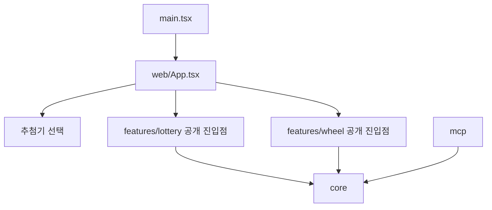
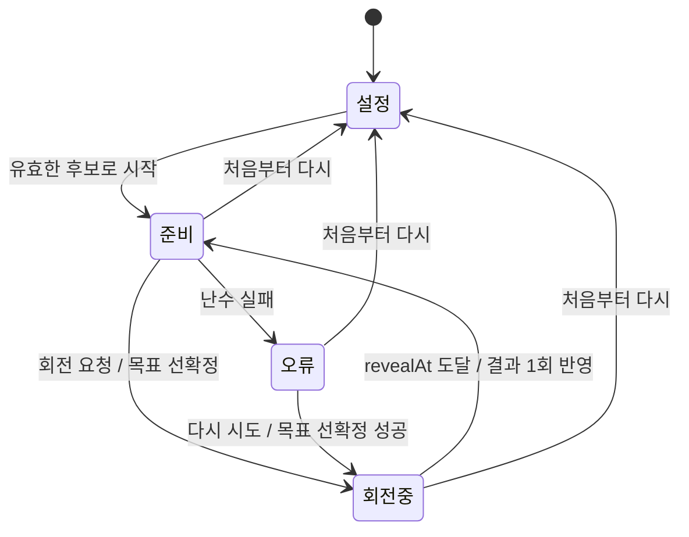

# 돌림판 추첨기 추가 스펙

## 1. 문서 개요

- 문서 경로: `docs/feature/wheel-draw/SPEC.md`
- 대상 브랜치: `feature/wheel-draw`
- 상태: 구현·통합 검증 완료
- 요구사항 기준: `docs/feature/wheel-draw/PRD.md`
- 구조 기준: `docs/feature/wheel-draw/DESIGN.md`
- 로또 회귀 기준: `docs/SPEC.md`

이 문서는 웹에 돌림판 추첨기를 추가하기 위한 기능·기술 계약을 정의한다. 기존 `docs/SPEC.md`는 로또 기능의 계약으로 유지하며, 이 문서의 복원 추첨 규칙을 로또나 Remote MCP에 적용하지 않는다.

## 2. 목표와 설계 원칙

### 2.1 목표

- 기본 선택 화면에서 로또와 돌림판을 선택해 사용할 수 있게 한다.
- 돌림판은 같은 후보가 반복 당첨될 수 있는 수동 복원 추첨을 제공한다.
- 결과를 회전 전에 안전한 난수로 확정하고 3.8~5.2초의 자연스러운 회전으로 표현한다.
- 결과 이력을 복사·비우고 후보와 설정은 기능 전용 저장소에 보존한다.
- 로또와 돌림판의 도메인·UI·서비스·테스트를 수직 기능 단위로 격리한다.
- 선택 셸 추가 외의 기존 로또 동작과 MCP 계약을 변경하지 않는다.

### 2.2 설계 원칙

- 공유 코어에는 후보, 입력 문법과 안전한 난수 프리미티브만 둔다.
- 로또와 돌림판 사이에 공통 세션, 결과, 완료 또는 capability 계약을 만들지 않는다.
- 각 추첨기는 공개 진입점 외에 상대 기능 내부를 import하지 않는다.
- 애니메이션·오디오·프레임 속도는 결과 선택에 영향을 주지 않는다.
- 실제 두 기능에서 동일한 책임이 확인되기 전에는 UI와 서비스 코드를 공통화하지 않는다.
- 파일 이동과 동작 변경을 분리해 기존 로또 회귀 원인을 추적할 수 있게 한다.

## 3. 범위와 우선순위

### 3.1 범위 내

- 로또·돌림판 선택 셸과 마지막 선택 강조
- 기능별 직접 진입과 선택 화면 복귀
- 기존 후보 입력 문법과 2~45개·20자 검증
- 수동 복원 추첨과 무제한 반복 회전
- 고유 outcome ID를 가진 결과 이력
- 결과 선확정과 목표 구획 정지
- 3.8~5.2초·6~10바퀴 회전, 동작 감소 대응과 테스트 후 감각 미세 조정
- SVG 돌림판, 축약 구획 레이블과 전체 후보 목록
- 결과 복사·비우기
- 기본 음소거인 회전·당첨 효과음
- 셸·돌림판 전용 버전 저장소
- 반응형·키보드·상태 안내
- 로또·MCP·빌드 경계 비회귀 검증

### 3.2 범위 밖

- 자동 회전과 목표 회전 횟수
- 당첨 후보 제거 옵션
- 돌림판 결과 이미지 저장과 결과 영속화
- 서버·계정·동기화·분석
- MCP 입력·출력과 MCP App UI 변경
- 별도 웹 빌드·배포
- 기존 로또 내부 동작 개선 또는 렌더러 재작성

### 3.3 우선순위

| 우선순위 | 요구사항 |
|---|---|
| P0 | 기능 경계, 선택 셸, 입력·검증, 결과 선확정, 복원 추첨, 반복 outcome, 결과 이력, 저장 격리, 로또 비회귀 |
| P1 | 자연스러운 SVG 회전, 후보 전체 이름, 복사·비우기, 직접 진입·뒤로 가기, 동작 감소, 반응형·키보드 |
| P2 | 효과음과 실제 브라우저 기반 회전 파라미터 미세 조정 |

## 4. 아키텍처와 의존성



의존성 계약은 다음과 같다.

- `web/App.tsx`는 추첨기 타입·표시 메타데이터와 공개 기능 컴포넌트만 참조한다.
- `features/lottery`와 `features/wheel`은 서로 직접 import하지 않는다.
- `core`는 `web/App`이나 특정 기능을 참조하지 않는다.
- `mcp`, `mcp-apps`, `api`의 기존 의존성 방향을 유지한다.
- `verify-boundaries.mjs`가 웹 하위 기능 경계를 자동 검사한다.

목표 디렉터리는 다음과 같다.

```text
src/web/
├── App.tsx
├── ExperienceErrorBoundary.tsx
├── experience.ts
├── experienceStorage.ts
├── main.tsx
├── shell.css
└── features/
    ├── lottery/
    │   ├── domain/
    │   ├── components/
    │   ├── services/
    │   └── index.ts
    └── wheel/
        ├── WheelApp.tsx
        ├── domain/
        │   ├── wheelSession.ts
        │   ├── wheelGeometry.ts
        │   └── wheelSetup.ts
        ├── components/
        │   ├── WheelSetup.tsx
        │   ├── WheelStage.tsx
        │   ├── WheelControls.tsx
        │   └── WheelResultHistory.tsx
        ├── services/
        │   ├── wheelStorage.ts
        │   └── wheelSoundController.ts
        ├── wheel.css
        └── index.ts
```

## 5. 추첨기 선택 셸

### 5.1 타입과 메타데이터

```ts
type DrawExperienceType = "lottery" | "wheel";

type DrawExperienceMetadata = {
  type: DrawExperienceType;
  label: string;
  description: string;
};
```

- 메타데이터에는 표시 정보만 포함한다.
- 세션 생성기, 추첨 전략, 저장 스키마 또는 capability를 레지스트리에 넣지 않는다.
- 기능 컴포넌트는 각 `features/<type>/index.ts`에서 공개한다.

### 5.2 내비게이션

- 정적 호스팅의 하위 경로 새로고침 문제를 피하도록 선택·기능 상태는 hash 기반 직접 주소로 제공한다.
- 선택 화면은 기본 주소 또는 `#/`에서 표시한다.
- 로또는 `#/lottery`, 돌림판은 `#/wheel`에서 직접 진입한다.
- 선택 화면에서 기능을 선택하면 같은 문서 안에서 해당 hash로 이동한다.
- 기능 화면의 `다른 추첨기 선택`은 `#/`로 이동한다.
- 선택 화면을 거쳐 기능에 진입한 경우 브라우저 뒤로 가기는 선택 화면으로 복귀한다.
- 기능 직접 주소로 처음 진입한 경우에도 앱은 선택 화면으로 돌아갈 수 있는 history 상태를 준비한다.
- 알 수 없는 hash는 선택 화면으로 안전하게 대체한다.
- 마지막 선택값은 선택 카드의 강조에만 사용하고 자동 진입에 사용하지 않는다.

### 5.3 셸 오류 격리

- 기능 공개 컴포넌트 렌더링 실패는 최상위 오류 경계에서 처리한다.
- 한 기능의 실패 화면에서 선택 화면으로 돌아갈 수 있어야 한다.
- 기능 오류가 상대 기능의 저장값을 삭제하거나 변경하지 않는다.

## 6. 후보 입력과 검증

- 돌림판은 현재 `core/input.ts`의 후보 문법과 제한을 그대로 사용한다.
- 줄바꿈·콤마 구분, 빈 항목 무시, 공백 제거를 지원한다.
- `이름*반복횟수`와 `시작숫자~끝숫자`를 지원한다.
- 최종 후보 수는 2~45개, 이름은 20자 이하다.
- 같은 이름을 여러 번 입력할 수 있다.
- 같은 이름의 후보도 입력 순서에 따라 서로 다른 ID를 가진다.
- 입력 검증 실패 시 세션을 만들지 않고 기존 한국어 오류를 표시한다.
- 공통 파서의 정책을 분리하는 새 계층은 돌림판 요구가 기존 제한과 달라지기 전까지 만들지 않는다.

돌림판 후보는 다음 형태로 만든다.

```ts
type WheelCandidate = {
  id: string;
  name: string;
};
```

- ID는 `wheel-candidate-${index + 1}`처럼 세션 안에서 안정적이고 고유하게 생성한다.
- ID는 중복 이름과 구획을 구분하는 용도이며 사용자에게 별도 식별자로 표시하지 않는다.

## 7. 돌림판 세션

### 7.1 데이터 모델

```ts
type WheelPhase = "ready" | "spinning" | "error";

type WheelOutcome = {
  id: string;
  spinNumber: number;
  candidateId: string;
  name: string;
  drawnAt: number;
};

type ActiveSpin = {
  outcomeId: string;
  targetCandidateId: string;
  startedAt: number;
  revealAt: number;
};

type WheelSession = {
  candidates: WheelCandidate[];
  phase: WheelPhase;
  activeSpin: ActiveSpin | null;
  outcomes: WheelOutcome[];
  error: string | null;
};
```

### 7.2 불변식

- 후보 배열은 세션 수명 동안 변경하지 않는다.
- `candidateId`는 여러 outcome에 반복될 수 있다.
- `WheelOutcome.id`는 세션 안에서 고유하다.
- `spinNumber`는 1부터 시작해 outcome 순서와 일치한다.
- `phase === "spinning"`일 때만 `activeSpin`이 존재한다.
- 하나의 `activeSpin`은 최대 하나의 outcome을 만든다.
- 완료 상태와 목표 outcome 수는 존재하지 않는다.
- 오류 세션은 결과를 임의 생성하지 않으며 사용자가 다시 시도하거나 설정으로 돌아갈 수 있다.

### 7.3 상태 전이



### 7.4 내부 계약

```ts
createWheelSession(candidates: WheelCandidate[]): WheelSession

beginWheelSpin(
  session: WheelSession,
  startedAt: number,
  durationMs: number,
  randomValues?: RandomValuesSource
): WheelSession

completeWheelSpin(
  session: WheelSession,
  outcomeId: string,
  now: number
): WheelSession

clearWheelOutcomes(session: WheelSession): WheelSession
```

- `beginWheelSpin`은 `ready` 또는 재시도 가능한 `error` 상태에서만 새 회전을 만든다.
- `secureRandomIndex(candidates.length)`로 목표 후보를 한 번 선택한다.
- 새 outcome ID는 `wheel-outcome-${outcomes.length + 1}`처럼 회전 순서에 따라 생성한다.
- `activeSpin.revealAt`은 `startedAt + durationMs`다.
- `spinning` 중 호출은 같은 세션을 반환한다.
- 난수 실패는 `activeSpin` 없이 `error` 상태로 전환한다.
- `completeWheelSpin`은 현재 `activeSpin.outcomeId`와 일치하고 `now >= revealAt`일 때만 결과를 추가한다.
- 같은 완료 호출을 반복해도 결과를 두 번 추가하지 않는다.
- 결과의 `drawnAt`은 논리적 공개 시각인 `revealAt`을 사용한다.
- `clearWheelOutcomes`는 후보를 유지하고 outcome만 비운 `ready` 상태를 반환한다.

## 8. 회전 각도와 애니메이션

### 8.1 순수 각도 계산

`wheelGeometry.ts`는 DOM·React와 난수에 의존하지 않는다.

```ts
getSegmentCenterAngle(candidateIndex: number, candidateCount: number): number

getTargetRotation(args: {
  currentRotation: number;
  candidateIndex: number;
  candidateCount: number;
  pointerAngle: number;
  minimumFullRotations: number;
}): number
```

- 구획 크기는 `360 / candidateCount`다.
- 목표는 후보 구획 중심이 포인터 중심에 오도록 계산한다.
- 현재 누적 회전보다 항상 큰 순방향 각도를 반환한다.
- 일반 회전에는 회전 강도에 따라 6~10회의 전체 회전을 더한다.
- 반환 각도는 누적값으로 유지해 연속 회전에서 역회전하지 않는다.
- 2개·45개 후보, 첫·마지막 후보와 0/360도 경계를 단위 테스트한다.

### 8.2 일반 회전

- 일반 논리적 회전 시간은 `3_800~5_200ms`이며 전체 회전 수 `6~10`과 같은 강도로 선형 증가한다.
- 회전 강도는 Web Crypto 기반 난수로 선택하되 당첨 후보 선택과 분리한다.
- 연출 강도 난수만 실패하면 최소 6회·3,800ms 프로필을 사용하고, 당첨 난수 실패 시 결과를 만들지 않는 계약은 유지한다.
- `WheelStage`는 하나의 SVG wheel group에 transform 애니메이션을 적용한다.
- 초기에는 짧게 속도를 높이고, 대부분의 시간은 순방향으로 회전하며, 마지막 구간에서 점진적으로 감속한다.
- 가속 비율, 중간 속도와 감속 곡선은 상수로 한 곳에서 관리한다.
- 구현 후 실제 Chrome·Safari·Firefox·Edge와 모바일 검수에서 자연스러움을 조정할 수 있다.
- 조정은 3.8~5.2초, 6~10회 순방향 회전, 목표 구획 중심 정지와 결과 선확정 계약을 바꾸지 않는다.
- transition/animation 완료 이벤트를 결과 반영의 유일한 근거로 사용하지 않는다.
- `WheelApp`은 `revealAt` 절대 시각에 세션을 완료하고, visibility·focus 복귀 시 이미 지난 회전을 한 번만 반영한다.
- 백그라운드에서 완료된 회전을 다시 장시간 재생하지 않는다.

### 8.3 동작 감소

- `prefers-reduced-motion: reduce`에서는 다회전 애니메이션을 사용하지 않는다.
- `300ms` 이하의 짧은 강조 전환 후 같은 목표 결과를 공개한다.
- 동작 감소 여부는 결과 선택, outcome ID와 결과 순서에 영향을 주지 않는다.

## 9. 돌림판 UI

### 9.1 설정 화면

- 후보 textarea, 후보 개수, 입력 오류와 입력 가이드를 제공한다.
- `입력 비우기`, 효과음 토글과 `돌림판 시작`을 제공한다.
- 유효하지 않은 입력에서는 시작 버튼을 비활성화한다.
- 로또 전용 추첨 개수, 수동·자동과 2D·3D 옵션을 표시하지 않는다.

### 9.2 회전 화면

- SVG 돌림판, 고정 포인터, 회전 버튼과 상태 텍스트를 제공한다.
- 회전 중 회전 버튼과 결과 비우기를 비활성화한다.
- `처음부터 다시`, `다른 추첨기 선택`을 제공한다.
- 후보 전체 이름 목록은 돌림판 옆 또는 아래의 스크롤 가능한 영역에 표시한다.
- 모바일에서는 후보 목록을 돌림판 아래에 배치한다.
- 구획 이름은 사용 가능한 공간에 맞춰 말줄임하되 후보 ID 순서를 유지한다.
- 후보 목록에는 축약하지 않은 최대 20자의 전체 이름을 표시한다.
- 색상 외에 텍스트와 순서로 구획을 구분할 수 있어야 한다.

### 9.3 결과 이력

- 각 결과에 회전 순서와 전체 후보 이름을 표시한다.
- 같은 후보가 연속 당첨돼도 outcome ID를 React key로 사용해 모두 표시한다.
- 최신 결과를 텍스트와 시각 표시로 구분한다.
- 결과가 없으면 첫 회전을 안내하는 빈 상태를 표시한다.
- `결과 복사`와 `결과 비우기`를 제공한다.
- 결과 비우기는 확인 없이 outcome만 삭제하고 후보·설정·현재 회전각을 유지한다.
- 복사 텍스트는 다음 형식이다.

```text
1. 민지
2. 준호
3. 민지
```

### 9.4 접근성

- 돌림판에는 후보 수와 현재 상태를 설명하는 접근 가능한 이름을 제공한다.
- 회전 시작, 회전 중, 당첨 결과를 상태 텍스트로 제공한다.
- 최신 당첨 결과는 과도한 중복 낭독 없이 live region으로 알린다.
- 키보드로 선택, 입력, 회전, 복사, 비우기와 화면 전환을 수행할 수 있다.
- 포커스 표시를 유지하고 회전 완료 후 임의로 포커스를 이동하지 않는다.
- 사용자 입력은 SVG와 DOM에 텍스트로만 삽입한다.

## 10. 효과음

- 돌림판은 로또 `SoundController`를 import하지 않고 자체 `WheelSoundController`를 소유한다.
- 기본 `soundEnabled` 값은 `false`다.
- 회전 시작 시 회전음을 시작하고 감속 구간에서 속도·음량을 낮춘다.
- 결과 공개 시 짧은 당첨음을 재생한다.
- 음소거, 설정 복귀, 기능 전환과 언마운트 시 모든 오디오 노드를 정리한다.
- 회전 중 효과음을 켜면 현재 회전 상태에 맞춰 재생을 시작할 수 있다.
- Web Audio 생성·재생 실패는 무음으로 격리하고 세션을 변경하지 않는다.

## 11. 저장 계약

### 11.1 키와 데이터

```ts
type StoredExperienceSelection = {
  version: 1;
  type: "lottery" | "wheel";
};

type StoredWheelCandidates = {
  version: 1;
  rawInput: string;
};

type StoredWheelOptions = {
  version: 1;
  soundEnabled: boolean;
};
```

```text
roulette:selected-experience:v1
wheel-draw:candidates:v1
wheel-draw:setup-options:v1
```

- 기존 `lottery-draw:names:v1`, `lottery-draw:setup-options:v1`을 변경하지 않는다.
- 셸 저장소는 기능별 후보·옵션 키를 읽거나 쓰지 않는다.
- 돌림판 저장소는 로또 키를 읽거나 쓰지 않는다.
- 손상 데이터는 기본값과 한국어 경고로 대체한다.
- 후보 입력 저장 실패는 현재 메모리 입력과 회전 가능 상태를 유지한다.
- 옵션 저장 실패는 현재 설정을 유지하고 새로고침 시 기본값으로 복구할 수 있음을 알린다.

### 11.2 수명주기

- 후보 원문은 수정할 때 저장한다.
- 효과음 설정은 변경할 때 저장한다.
- outcome, activeSpin과 누적 회전각은 저장하지 않는다.
- 새로고침은 저장된 후보·효과음 설정을 복원하고 설정 화면에서 시작한다.
- `처음부터 다시`는 후보·효과음 설정을 유지하고 세션·outcome을 삭제한다.
- `다른 추첨기 선택`은 진행 중 타이머·애니메이션·음향과 outcome을 삭제한다.
- `입력 비우기`는 돌림판 후보 키만 삭제한다.

## 12. 오류 처리

| 상황 | 처리 |
|---|---|
| 후보 문법·개수·길이 오류 | 원인 표시, 시작 비활성화 |
| Web Crypto 실패 | outcome 없이 오류 상태, 재시도 안내, 대체 난수 금지 |
| 저장·복원 실패 | 기본값 또는 메모리 상태 유지, 기능별 경고 |
| 클립보드 실패 | 결과 유지, 복사 오류 알림 |
| SVG/애니메이션 실패 | 확정 결과는 논리 시각에 반영, 정적 결과와 경고 표시 |
| 효과음 실패 | 무음으로 계속 진행 |
| 알 수 없는 직접 주소 | 선택 화면으로 복구 |
| 기능 렌더링 오류 | 셸 오류 경계와 선택 화면 복귀 제공 |

- 기술 예외·스택과 사용자 입력 원문을 오류 메시지에 노출하지 않는다.
- 돌림판 오류는 로또 저장값과 현재 로또 기능을 변경하지 않는다.

## 13. 기존 로또와 MCP 비회귀 계약

- 구조 이동 전 기존 웹 테스트를 기준선으로 실행한다.
- 로또 내부의 `Ball`, `DrawSession`, 비복원 엔진과 자동 일정을 범용화하지 않는다.
- 로또 수동·자동·재추첨·처음부터 다시·Space/R 단축키 동작을 유지한다.
- 2D Canvas·3D WebGL·fallback·완료 후 정착을 유지한다.
- 로또 입력·옵션 저장 키와 v1 데이터 복원을 유지한다.
- 로또 효과음, 결과 복사와 이미지 저장을 유지한다.
- 로또의 DOM 접근 가능한 이름과 사용자 문구는 셸 진입에 필요한 변경 외에는 유지한다.
- `src/core/draw.ts`와 MCP의 비복원 결과 계약을 변경하지 않는다.
- MCP App 리소스, 도구 이름·스키마·결과 `_meta`와 Vercel Function 구성을 변경하지 않는다.
- 이동 직후와 전체 완료 시 기존 로또·core·MCP 테스트 및 빌드가 모두 통과해야 한다.

## 14. 테스트와 검수

### 14.1 자동 테스트

- 셸의 기본·직접·알 수 없는 주소와 뒤로 가기
- 마지막 선택 저장·강조와 손상 데이터 복구
- 기능 간 저장 키 격리
- 기존 후보 문법과 2·45·46개, 20·21자 경계
- 중복 이름의 서로 다른 후보 ID
- 같은 난수 인덱스로 같은 후보의 연속 당첨
- 반복 당첨 outcome ID와 순서의 고유성
- 회전 중 중복 시작 무시
- 완료 호출 멱등성과 늦은 타이머 복구
- 난수 실패의 오류 상태와 대체 난수 금지
- 2·45개 및 0/360도 경계 목표 각도
- 6~10회 순방향 회전과 목표 구획 중심 정지
- 동작 감소 환경의 같은 결과와 짧은 전환
- 결과 복사 형식과 결과 비우기
- 후보·옵션 저장·복원·삭제·실패
- 효과음 기본 음소거와 수명주기 정리
- 기능 전환 시 타이머·애니메이션·오디오 정리
- 로또 기존 테스트 전체 회귀
- 웹 기능 간 import 경계 위반 fixture

### 14.2 브라우저 검수

- 데스크톱과 320px 이상 모바일에서 선택·설정·회전·결과가 잘리거나 겹치지 않는다.
- 일반 회전이 3.8~5.2초·6~10바퀴 범위에서 역회전·점프 없이 자연스럽게 감속한다.
- 반복 회전의 시작 속도와 정지 감각을 실제 브라우저에서 미세 조정한다.
- 당첨 구획 중심과 포인터가 일치한다.
- 45개 후보에서 구획 축약과 전체 후보 목록을 함께 확인할 수 있다.
- 저성능·리사이즈·백그라운드 복귀 후에도 결과가 한 번만 반영된다.
- 동작 감소 환경에서 장시간 회전 없이 같은 결과를 확인한다.
- 키보드만으로 전체 핵심 흐름을 수행한다.
- 로또 설정·수동·자동·완료 핵심 흐름이 기존과 동일하다.

초기 구현 검수에서는 Chrome과 인앱 Chromium의 데스크톱·320px 화면에서 선택, 로또, 8개·45개 돌림판과 4초 기준 회전을 확인했다. 이후 가변 회전 계약의 3.8초·6바퀴와 5.2초·10바퀴 경계 및 결과 공개 시각은 자동 테스트로 검증했다. 키보드 전체 흐름과 동작 감소 220ms 전환도 자동 테스트로 검증했다. 현재 실행 환경에서 제공되지 않는 Safari·Firefox·Edge 실기 검수는 잔여 환경 제한으로 기록한다.

### 14.3 검증 명령

```bash
npm run test:core
npm run test:web
npm run test:mcp-app
npm run build:web
npm run build:mcp
npm run test:mcp
npm run verify:boundaries
```

최종 승인 전에는 `npm run verify`도 통과해야 한다.

## 15. 성능·보안·운영

- 후보 45개에서도 구획 계산과 회전 transform이 입력·제어 응답을 막지 않아야 한다.
- 매 프레임 SVG 구획 DOM을 다시 만들지 않고 wheel group transform만 갱신한다.
- 기능 언마운트 시 timer, animation과 audio resource를 정리한다.
- 사용자 입력을 HTML로 해석하지 않는다.
- 후보와 결과를 외부 네트워크나 애플리케이션 로그로 전송하지 않는다.
- 새 원격 분석·모니터링·외부 미디어 의존성을 추가하지 않는다.
- 동일 웹 빌드를 유지하고 별도 배포 조건이 생길 때만 빌드 분리를 재검토한다.

## 16. 리스크와 대응

| 리스크 | 대응 |
|---|---|
| 대규모 파일 이동으로 로또 회귀 발생 | 구조 이동을 독립 단계로 수행하고 이동 전후 전체 웹 테스트 비교 |
| 공통 세션 추상화가 다시 도입됨 | 기능별 세션 유지와 import 경계 자동 검사 |
| 반복 후보가 React key에서 충돌 | 후보 ID와 별도의 outcome ID 사용 |
| 애니메이션 종료 이벤트 누락 | 절대 revealAt과 멱등 완료 전이 사용 |
| 자연스러운 감속과 정확한 정지 간 불일치 | 목표 각도 순수 계산과 회전 파라미터 분리, 브라우저 미세 조정 |
| 45개 구획 레이블 가독성 저하 | 구획 말줄임과 별도 전체 후보 목록 병행 |
| 저장소 통합으로 기존 로또 데이터 유실 | 셸·로또·돌림판 키와 어댑터 분리 |

## 17. 출시 승인 조건

- P0·P1 요구사항과 자동 테스트가 완료되어 있다.
- P2 효과음과 회전 미세 조정의 알려진 결함이 없거나 명시적으로 승인되어 있다.
- 돌림판이 같은 후보의 반복 당첨을 정확히 기록한다.
- 목표 구획과 포인터가 일반·동작 감소 환경 모두에서 일치한다.
- 결과 복사·비우기와 기능별 저장 수명주기가 요구사항대로 동작한다.
- 모바일·데스크톱 핵심 흐름과 자연스러운 회전 검수가 완료된다.
- 기존 로또 기능·저장값과 MCP 계약에 회귀가 없다.
- 전체 테스트, 타입 검사, 프로덕션 빌드와 경계 검증이 통과한다.

## 18. 오픈 이슈

제품·기술 계약의 오픈 이슈와 알려진 기능 결함은 없다. 회전 가속·감속은 3.8~5.2초, 6~10회 순방향 회전, 결과 선확정과 목표 구획 중심 정지 계약으로 구현·검증했다. Safari·Firefox·Edge 실기 검수는 현재 실행 환경에서 수행하지 못한 검증 범위 제한이다.
